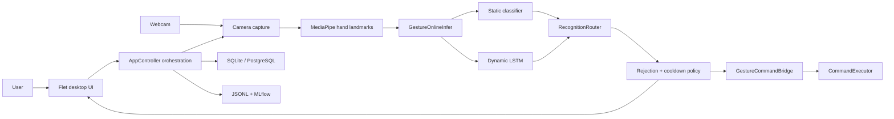
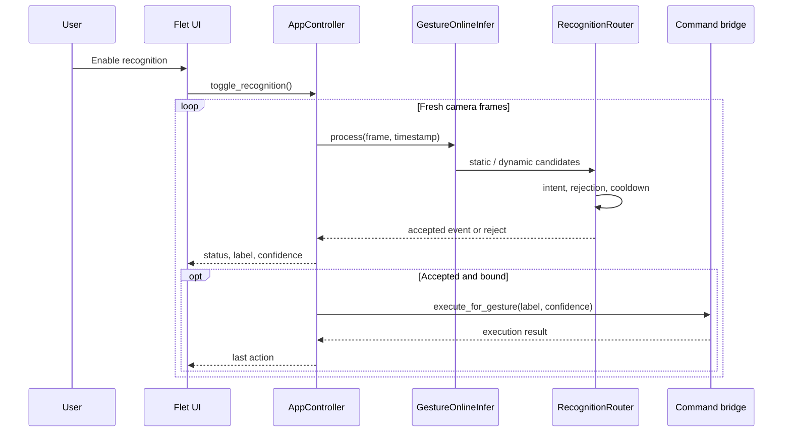
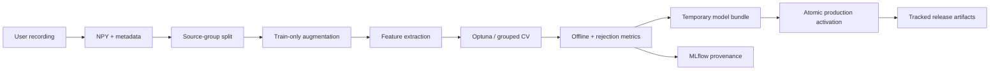

# GestureBind Architecture

This document describes the release architecture of GestureBind MVP. It is the
source of truth for runtime boundaries, data ownership and repository scope.
Experiment details live in `docs/experiments/`; they do not redefine the
production path.

## 1. MVP Boundary

GestureBind is a local-first macOS desktop application that lets a user:

1. record personal static and dynamic hand gestures;
2. train local classifiers from the recorded samples;
3. recognize gestures from a webcam in real time;
4. bind accepted gestures to validated desktop commands;
5. inspect live quality and MLflow evidence.

The release has one desktop runtime: Flet. Research models remain available for
reproducibility, but the production route is intentionally narrow:

| Concern | Production choice |
|---|---|
| UI | Flet desktop, `python -m app.flet_app.main` |
| Hand tracking | MediaPipe Tasks + OpenCV |
| Static recognition | crafted geometry features + tree classifier |
| Dynamic recognition | `dynamic_landmark_lstm_backbone` |
| Open-set safety | negative classes, confidence/margin and prototype checks |
| Storage | local SQLite by default; PostgreSQL is optional |
| Observability | JSONL runtime logs + local MLflow |
| Command execution | allowlisted typed actions through `CommandExecutor` |

Not part of the MVP release: user datasets, secrets, local databases, MLflow
runs, generated reports, virtual environments, IDE state and retired UI
implementations.

## 2. System Context



All camera frames, landmarks, samples and predictions remain local unless the
user explicitly configures an external service. Command execution is separated
from model inference by a policy and validation boundary.

## 3. Runtime Flow



Static gestures require dwell confirmation. Dynamic gestures are temporal
events and are emitted immediately after segmentation and model validation;
they do not wait for the static dwell counter.

## 4. Training And Publication



Augmented descendants must stay in the same source group as their original
sample. Normalization is fitted on the training split only. Model publication
writes sidecars first and activates the model last; a failed activation restores
the previous complete bundle.

## 5. Module Ownership

```text
app/flet_app/                 UI composition and application orchestration
app/services/                 domain services, policies and command execution
app/models/                   persistence models and database adapter
app/gesture_online_infer.py   online CV/ML inference coordinator
cv/                           features, augmentation, training and model code
configs/                      versioned taxonomy and dataset contracts
models/                       allowlisted production model bundle only
scripts/                      reproducible checks, reports and maintenance tools
tests/                        unit and integration contracts
docs/                         curated product, ML and operations documentation
.github/workflows/            CI, smoke, Docker and release automation
```

Dependency direction:

1. views call `AppController`, not CV or database adapters directly;
2. the controller orchestrates services but does not own feature math;
3. `app/services` may use persistence interfaces and standard libraries, but
   must not import Flet views;
4. `cv` is UI-independent and can be exercised from CLI/tests;
5. command execution never receives raw model objects or camera frames.

`AppController` is currently the composition root and the main remaining
monolith. New domain logic should go into a focused service or `cv` module;
only wiring and UI event coordination should be added to the controller.

## 6. Data And Artifact Ownership

| Data | Default location | Git policy |
|---|---|---|
| User gesture samples | `data/gestures/` or configured path | ignored |
| User configuration | `~/.dplm/config.json` | outside repository |
| Local SQLite database | `~/.dplm/dplm.sqlite` | outside repository |
| Runtime logs | `~/.dplm/logs/` | outside repository |
| MLflow backend | `mlflow.db`, `mlruns/` | ignored |
| Production models | allowlist under `models/` | tracked |
| Experiment models | `models/experiments/` | ignored |
| Generated reports | `outputs/`, generated docs | ignored |

The compatibility filename `models/knn.pkl` is retained for the static
production artifact even when the serialized estimator is not KNN. The model
type and feature contract are determined by its sidecars and provenance, not by
the historical filename.

## 7. Quality Attributes

- **Safety:** open-set rejection, confidence threshold, per-gesture cooldown,
  typed action schemas and warnings for dangerous commands.
- **Privacy:** camera data and samples are local by default; secrets are never
  committed.
- **Reproducibility:** grouped validation, dataset/model hashes, Git state and
  MLflow metadata are recorded for training runs.
- **Reliability:** model bundles are activated atomically and camera preview is
  decoupled from ML frame processing.
- **Performance:** UI frame delivery is throttled independently from inference;
  release latency is benchmarked before publication.
- **Maintainability:** one UI runtime, explicit layer ownership and an automated
  tracked-tree hygiene gate.

## 8. Release Contract

A release is valid when:

1. `python -m scripts.check_repository_hygiene` succeeds;
2. unit/integration tests and `make ml-smoke` succeed;
3. all required production model files are present;
4. `VERSION`, `CHANGELOG.md` and `RELEASE_NOTES.md` agree;
5. the source bundle is produced with `git archive`, so it contains tracked
   files only;
6. a short live matrix is run for static, dynamic and no-command scenarios.

The detailed ML evidence and current limitations are maintained in
`docs/contest/ML_SYSTEM_DESIGN.md` and
`docs/experiments/release_readiness_2026-07-10.md`.
