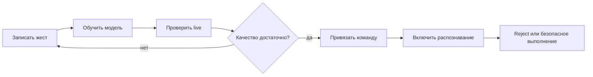

# GestureBind

> Локальная ML-система, в которой пользователь записывает собственные жесты,
> обучает модели и привязывает надежные распознавания к командам macOS.

[](https://github.com/Rafaildavar/GestureBind/actions/workflows/ci.yml)
[](https://github.com/Rafaildavar/GestureBind/actions/workflows/ml-smoke.yml)
[](https://github.com/Rafaildavar/GestureBind/releases)
[](LICENSE)

GestureBind MVP `0.8.0` превращает обычную веб-камеру в персональный слой
управления компьютером. Все основные данные и инференс остаются локальными.

## Что Входит В MVP

| Возможность | Реализация |
|---|---|
| Desktop UI | единый Flet-интерфейс для камеры, жестов, обучения и привязок |
| Персональные классы | запись статических и динамических жестов из приложения |
| Static ML | геометрические признаки кисти, tree classifier, open-set rejection |
| Dynamic ML | `dynamic_landmark_lstm_backbone` по последовательности landmarks |
| Обучение | train-only GISLR-style augmentation, grouped validation, Optuna |
| Команды | typed actions, hotkeys, media, navigation, app launch и sequences |
| Безопасность | confidence gate, adaptive completion gate, negative classes, cooldown |
| Наблюдаемость | live evaluation, JSONL runtime logs, MLflow provenance |
| Хранение | SQLite по умолчанию, PostgreSQL опционально |

В релиз не входят пользовательские датасеты, секреты, локальные БД, MLflow
runs, не включенные в release allowlist generated reports и экспериментальные
model artifacts.

## Пользовательский Сценарий



1. Пользователь записывает несколько независимых дублей каждого жеста.
2. Приложение обучает только классы из пользовательского датасета.
3. Static и dynamic маршруты оцениваются раздельно.
4. Низкая уверенность и неизвестное движение отклоняются.
5. Команда выполняется только после policy и cooldown.

## Production ML

MediaPipe извлекает `21 x xyz` landmarks руки. Для static-жестов используются
полные pairwise distances, углы пальцев и временные агрегаты. Dynamic LSTM
получает нормализованную последовательность `72 x 22 x 3` и сохраняет
глобальную траекторию, необходимую для направленных движений.
Release auto-router принимает static-предсказания от `0.80`, а dynamic — от
`0.90`; порог выполнения привязанной команды остается отдельным барьером.

Перед нормализацией амплитуды dynamic-пайплайн проверяет, завершен ли жест.
Для каждого пользовательского класса verifier автоматически обучается на его
полных записях, собственных префиксах и префиксах остальных классов. Если
кандидат отклонен, сегментатор сохраняет уже выполненную часть и ждет
продолжения, не испуская команду по неподвижному неполному жесту.

Текущая release evidence:

| Проверка | Результат |
|---|---:|
| Static grouped CV accuracy | `0.7767` |
| Static grouped CV macro F1 | `0.6613` |
| Dynamic grouped validation accuracy | `0.8571` |
| Dynamic prototype positive recall | `0.9333` |
| Dynamic negative false-positive rate | `0.0000` |
| Dynamic ML latency, mean / p95 | `13.979 / 16.013 ms` |
| Completion gate, full source recordings | `60/60 = 1.0000` |
| Completion gate, prefix accepts before / after | `214/240 / 6/240` |
| Online state-machine replay, full / wrong class | `59/60 / 0` |
| Online state-machine replay, prefix false accepts | `5/240 = 0.0208` |
| Post-gate controlled live static recall at threshold `0.80` | `20/20 = 1.0000` |
| Post-gate controlled live dynamic recall at threshold `0.90` | `38/40 = 0.9500` |
| Post-gate positive total / wrong class | `58/60 = 0.9667 / 0` |

Post-gate live breakdown при release-пороге `0.90`: `SwipeLeft 20/20`,
`diagonal 9/10` (`1` пропуск), `zoom 9/10` (`1` пропуск). Неверных
dynamic-классов в этом прогоне не отмечено.
Результат относится к персональному controlled protocol: рука полностью в
кадре, а форма и траектория соответствуют записанному жесту. Offline-метрики
нужны для сравнения моделей, но не заменяют webcam-проверку и отдельный
`no-command` safety run.
Completion replay использует текущие source recordings через production
`GestureOnlineInfer`; это regression evidence, а не независимый test set.
Положительный webcam-run после gate выполнен; до release tag остается отдельная
матрица partial/look-alike и `no-command` движений.

## Архитектура

```text
app/flet_app/                 Flet UI и composition root
app/services/                 policies, команды, конфигурация и domain services
app/models/                   persistence и database adapter
app/gesture_online_infer.py   online CV/ML coordinator
cv/                           признаки, augmentation, обучение и модели
configs/                      taxonomy и versioned contracts
models/                       только allowlisted production bundle
scripts/                      smoke, benchmark и maintenance commands
tests/                        unit/integration contracts
docs/                         curated product, ML и operations docs
```

Полная схема слоев, runtime sequence, training publication и ownership данных:
[ARCHITECTURE.md](ARCHITECTURE.md).

## Быстрый Старт

Требования: macOS, Python `3.11`, веб-камера.

```bash
git clone https://github.com/Rafaildavar/GestureBind.git
cd GestureBind

python3.11 -m venv .venv
source .venv/bin/activate
python -m pip install --upgrade pip
python -m pip install -r requirements.txt
```

Для разработки и тестов:

```bash
python -m pip install -r requirements-dev.txt
```

TensorFlow нужен только для исторического CNN benchmark:

```bash
python -m pip install -r requirements-research.txt
```

Запуск релизного desktop-приложения:

```bash
./scripts/launch_app.sh
```

Эквивалентная команда:

```bash
PYTHONDONTWRITEBYTECODE=1 python -B -m app.flet_app.main
```

SQLite используется автоматически и не требует Docker. Для PostgreSQL:

```bash
docker compose up -d db
export DPLM_DB_BACKEND=postgres
```

При первом запуске macOS запросит доступ к камере. Для выполнения hotkeys и
управления курсором также может понадобиться Accessibility permission.

## Локальные Данные

| Данные | Расположение |
|---|---|
| Конфигурация | `~/.dplm/config.json` |
| SQLite | `~/.dplm/dplm.sqlite` |
| Runtime logs | `~/.dplm/logs/` |
| Samples в source checkout | `data/gestures/` или настроенный путь |
| MLflow | `mlflow.db`, `mlruns/` |

Эти пути исключены из Git. В `models/` отслеживается только production bundle,
нужный для первого запуска и smoke validation.

## Проверки

```bash
# Чистота tracked-дерева и release contract
PYTHON=.venv/bin/python make repo-hygiene

# Unit/integration tests + ML artifact smoke
PYTHON=.venv/bin/python make ci

# Только production model smoke
PYTHON=.venv/bin/python make ml-smoke

# Full/prefix benchmark через production dynamic state machine
python -m scripts.evaluate_dynamic_completion --log-mlflow

# Локальный MLflow UI
PYTHON=.venv/bin/python make mlflow-ui
```

MLflow открывается на [http://127.0.0.1:5000](http://127.0.0.1:5000).

## Release

GitHub release workflow создает source/model bundle через `git archive`.
Поэтому архив содержит только tracked-файлы текущего commit и не может случайно
захватить `.env`, датасет, локальную БД или experiment outputs.

Перед публикацией:

1. выполнить `make ci`;
2. пройти live static/dynamic/no-command matrix;
3. проверить `VERSION`, `CHANGELOG.md` и `RELEASE_NOTES.md`;
4. создать tag `v0.8.0` только после ручного release QA.

## Документация

- [Architecture](ARCHITECTURE.md)
- [Training Workflow](docs/TRAINING_WORKFLOW.md)
- [Binding Rules](docs/BINDING_RULES.md)
- [Database Schema](docs/DB_SCHEMA.md)
- [CI/CD](docs/CI_CD.md)
- [ML System Design](docs/contest/ML_SYSTEM_DESIGN.md)
- [Dynamic Completion Benchmark](docs/experiments/dynamic_completion_benchmark.md)
- [Release Readiness](docs/experiments/release_readiness_2026-07-10.md)

## Ограничения MVP

- production UX и command execution ориентированы на macOS;
- приложение пока не подписано Developer ID и не notarized;
- качество новых пользовательских классов зависит от разнообразия записей;
- публичные benchmark datasets используются как исследовательская проверка, а
  не как замена персональному датасету;
- `AppController` остается крупным composition root; новая domain-логика должна
  выноситься в `app/services` или `cv`.

## License

MIT. See [LICENSE](LICENSE).
