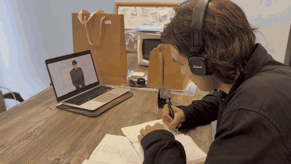
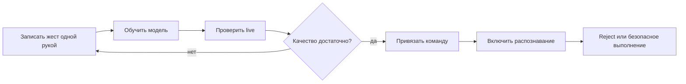
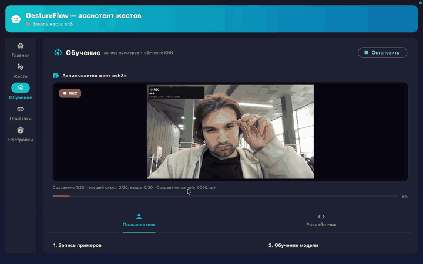

# GestureBind

> Локальное desktop-приложение, которое обучается жестам пользователя и
> превращает их в команды для компьютера. Текущий стабильный релиз предназначен
> для macOS; поддержка Windows находится в активной разработке.

[](https://github.com/Rafaildavar/GestureBind/actions/workflows/ci.yml?query=branch%3Acontest_version)
[](https://github.com/Rafaildavar/GestureBind/actions/workflows/ml-smoke.yml?query=branch%3Acontest_version)
[](https://github.com/Rafaildavar/GestureBind/releases)
[](LICENSE)

<p align="center">
  
</p>

<p align="center"><sub>Продуктовый сценарий: переключение учебных материалов жестами без мыши.</sub></p>

GestureBind использует обычную веб-камеру как персональный слой управления:
пользователь записывает собственные жесты одной рукой, обучает локальные модели,
проверяет распознавание в реальном времени и связывает жесты с системными
командами. Видео, landmarks, названия жестов и команды не покидают компьютер.

GestureBind MVP `0.8.1` сейчас является release candidate поверх опубликованного
`v0.8.0`. Нативный macOS bundle, opt-in telemetry и одноручный режим уже
находятся в коде; tag `v0.8.1` будет создан после финальной проверки.

[Релизы](https://github.com/Rafaildavar/GestureBind/releases) ·
[Платформы](#поддержка-платформ) ·
[Актуальный интерфейс](#актуальный-интерфейс) ·
[Быстрый старт](#быстрый-старт) ·
[Архитектура](ARCHITECTURE.md) ·
[Обучение](docs/TRAINING_WORKFLOW.md) ·
[Правила привязок](docs/BINDING_RULES.md)

## Что уже работает

| Возможность | Реализация |
|---|---|
| Полный desktop-поток | единый Flet-интерфейс для камеры, записи, обучения, проверки и привязок |
| Персональные жесты | статические позы и динамические движения, записанные самим пользователем |
| Режим ввода | одна рука; двуручная запись и обучение временно отключены |
| Локальное ML | static tree classifier и dynamic landmark LSTM с open-set rejection |
| Команды macOS | hotkeys, media, navigation, запуск приложений и последовательности действий |
| Агент привязок | разбирает обычную фразу и формирует проверяемый черновик привязки |
| Защита от ошибок | confidence gate, completion gate, negative classes и cooldown |
| Локальные данные | SQLite по умолчанию, PostgreSQL опционально, камера не отправляется в облако |
| Контроль качества | live evaluation, обратная связь, JSONL, MLflow и opt-in daily telemetry |
| Доставка | запускаемый `GestureBind.app` и tracked source bundle через release workflow |

## Поддержка платформ

| Платформа | Статус | Текущий этап |
|---|---|---|
| macOS | **Поддерживается** | полный пользовательский поток, системные команды и готовый `GestureBind.app` |
| Windows | **Активная разработка** | адаптация системных действий, Windows CI и подготовка нативной сборки |
| Linux и другие desktop-системы | **Следующий этап** | перенос начнётся после стабилизации и приёмочного тестирования Windows-версии |

Архитектура UI, камеры и ML-пайплайна изначально остаётся переносимой. Каждая
новая ОС получит статус поддерживаемой только после отдельной проверки камеры,
обучения, распознавания, выполнения команд и сборки установочного артефакта.

В релиз не входят пользовательские датасеты, секреты, локальные БД, MLflow
runs, не включенные в release allowlist generated reports и экспериментальные
model artifacts.

## Как это работает



1. Пользователь записывает несколько независимых дублей жеста одной рукой.
2. Приложение обучает только классы из локального пользовательского датасета.
3. Static и dynamic маршруты проверяются раздельно в live-режиме.
4. Низкая уверенность, неизвестное движение и незавершённый жест отклоняются.
5. Привязанная команда выполняется только после policy-проверок и cooldown.

## Актуальный интерфейс

### Запись персонального жеста

Студия обучения записывает независимые дубли жеста одной рукой и показывает
landmarks, текущий дубль и общий прогресс прямо в окне приложения.

<p align="center">
  
</p>

## Быстрый старт

Для текущего официального релиза нужны macOS и веб-камера. Ветка является
release candidate `0.8.1`, поэтому до публикации tag её следует запускать из
исходного кода с Python `3.11`. Инструкции для Windows появятся после завершения
активной разработки и приёмочного тестирования этой платформы.

После публикации `v0.8.1` GitHub Release будет содержать
`GestureBind-macos-v0.8.1.zip`. Для этого варианта Python пользователю не нужен:
достаточно распаковать архив, открыть `GestureBind.app` и разрешить доступ к
камере. Пока приложение не notarized, при первом запуске может понадобиться
правый клик по приложению и команда `Open`.

```bash
git clone https://github.com/Rafaildavar/GestureBind.git
cd GestureBind

python3.11 -m venv .venv
source .venv/bin/activate
python -m pip install --upgrade pip
python -m pip install -r requirements.txt
```

Для разработки и тестов:

```bash
python -m pip install -r requirements-dev.txt
```

TensorFlow нужен только для исторического CNN benchmark:

```bash
python -m pip install -r requirements-research.txt
```

Запуск desktop-приложения:

```bash
./scripts/launch_app.sh
```

Эквивалентная команда:

```bash
PYTHONDONTWRITEBYTECODE=1 python -B -m app.flet_app.main
```

SQLite используется автоматически и не требует Docker. Для PostgreSQL:

```bash
docker compose up -d db
export DPLM_DB_BACKEND=postgres
```

При первом запуске macOS запросит доступ к камере. Для выполнения hotkeys и
управления курсором также может понадобиться Accessibility permission.

Анонимная статистика качества выключена по умолчанию. После согласия в разделе
«Приватность» приложение раз в 24 часа отправляет только агрегаты распознавания,
обратной связи и производительности. Видео, landmarks, названия пользовательских
жестов и команды не передаются.

## Production ML

MediaPipe извлекает `21 x xyz` landmarks руки. Для static-жестов используются
полные pairwise distances, углы пальцев и временные агрегаты. Dynamic LSTM
получает нормализованную последовательность `72 x 22 x 3` и сохраняет
глобальную траекторию, необходимую для направленных движений.
Release auto-router принимает static-предсказания от `0.80`, а dynamic — от
`0.90`; порог выполнения привязанной команды остается отдельным барьером.

Перед нормализацией амплитуды dynamic-пайплайн проверяет, завершён ли жест.
Для каждого пользовательского класса verifier автоматически обучается на его
полных записях, собственных префиксах и префиксах остальных классов. Если
кандидат отклонён, сегментатор сохраняет уже выполненную часть и ждёт
продолжения, не испуская команду по неподвижному неполному жесту.

<details>
<summary><strong>Evidence snapshot от 10.07.2026 и результаты controlled live-проверок</strong></summary>

Production-модели после этих прогонов не изменялись, поэтому offline, replay и
model-stage latency остаются актуальны для текущего bundle. Одноручный режим
записи и обучения был зафиксирован `11.07.2026`; отдельный controlled live-прогон
после этого UX-изменения ещё не повторялся.

Текущая release evidence:

| Проверка | Результат |
|---|---:|
| Static grouped CV accuracy | `0.7767` |
| Static grouped CV macro F1 | `0.6613` |
| Dynamic grouped validation accuracy | `0.8571` |
| Dynamic prototype positive recall | `0.9333` |
| Dynamic negative false-positive rate | `0.0000` |
| Dynamic ML latency, mean / p95 | `13.979 / 16.013 ms` |
| Completion gate, full source recordings | `60/60 = 1.0000` |
| Completion gate, prefix accepts before / after | `214/240 / 6/240` |
| Online state-machine replay, full / wrong class | `59/60 / 0` |
| Online state-machine replay, prefix false accepts | `5/240 = 0.0208` |
| Post-gate controlled live static recall at threshold `0.80` | `20/20 = 1.0000` |
| Post-gate controlled live dynamic recall at threshold `0.90` | `38/40 = 0.9500` |
| Post-gate positive total / wrong class | `58/60 = 0.9667 / 0` |
| Partial/look-alike false-command rate | `1/20 = 0.0500` |
| Background/no-command false-command rate | `0/30 = 0.0000` |
| Aggregate safety false-command rate | `1/50 = 0.0200` |

Post-gate live breakdown при release-пороге `0.90`: `SwipeLeft 20/20`,
`diagonal 9/10` (`1` пропуск), `zoom 9/10` (`1` пропуск). Неверных
dynamic-классов в этом прогоне не отмечено.
Результат относится к персональному controlled protocol: рука полностью в
кадре, а форма и траектория соответствуют записанному жесту. Offline-метрики
нужны для сравнения моделей, но не заменяют webcam-проверку и отдельный
`no-command` safety run.
Completion replay использует текущие source recordings через production
`GestureOnlineInfer`; это regression evidence, а не независимый test set.
Webcam positive и safety runs после gate выполнены. Partial/look-alike движения
дали `1/20` ложную команду, а background/no-command сценарии не дали ни одной
команды в `30` попытках. Оба показателя проходят release target `<=10%`.

</details>

## Архитектура

```text
app/flet_app/                 Flet UI и composition root
app/services/                 policies, команды, конфигурация и domain services
app/models/                   persistence и database adapter
app/gesture_online_infer.py   online CV/ML coordinator
cv/                           признаки, augmentation, обучение и модели
configs/                      taxonomy и versioned contracts
models/                       только allowlisted production bundle
scripts/                      smoke, benchmark и maintenance commands
tests/                        unit/integration contracts
docs/                         curated product, ML и operations docs
```

Полная схема слоев, runtime sequence, training publication и ownership данных:
[ARCHITECTURE.md](ARCHITECTURE.md).

## Эволюция интерфейса

Текущий продукт использует единый Flet-интерфейс, описанный выше. Запись ниже
сделана `18 июня 2026 года` и показывает ранний прототип полного цикла:
запись жеста, обучение, создание сценария и распознавание. Она сохранена как
история развития проекта; расположение экранов и часть элементов управления
уже не соответствуют актуальной версии.

<details>
<summary><strong>Посмотреть ранний интерфейс</strong></summary>

<p align="center">
  
</p>

</details>

## Локальные данные

| Данные | Расположение |
|---|---|
| Конфигурация | `~/.dplm/config.json` |
| SQLite | `~/.dplm/dplm.sqlite` |
| Runtime logs | `~/.dplm/logs/` |
| Daily telemetry state | `~/.dplm/logs/telemetry_state.json` |
| Samples в source checkout | `data/gestures/` или настроенный путь |
| MLflow | `mlflow.db`, `mlruns/` |

Эти пути исключены из Git. В `models/` отслеживается только production bundle,
нужный для первого запуска и smoke validation.

## Проверки

```bash
# Чистота tracked-дерева и release contract
PYTHON=.venv/bin/python make repo-hygiene

# Unit/integration tests + ML artifact smoke
PYTHON=.venv/bin/python make ci

# Только production model smoke
PYTHON=.venv/bin/python make ml-smoke

# Full/prefix benchmark через production dynamic state machine
python -m scripts.evaluate_dynamic_completion --log-mlflow

# Локальный MLflow UI
PYTHON=.venv/bin/python make mlflow-ui
```

MLflow открывается на [http://127.0.0.1:5000](http://127.0.0.1:5000).

## Release

GitHub release workflow создает два артефакта:

- `gesturebind-v0.8.1.tar.gz` с tracked source/model файлами;
- `GestureBind-macos-v0.8.1.zip` с запускаемым `GestureBind.app`.

Source bundle создается через `git archive`, поэтому он не может случайно
захватить `.env`, датасет, локальную БД или experiment outputs. macOS bundle
собирается на GitHub-hosted macOS runner и проходит ML smoke до упаковки.

Статус `v0.8.1`: **release candidate**. Базовая positive matrix: `58/60`, wrong
class `0`; safety matrix: `49/50` безопасных отклонений, background false
commands `0/30`. После перехода на одноручный MVP требуется повторить финальный
controlled live-прогон, не меняя frozen production-модели.

Перед публикацией:

1. выполнить `make ci`;
2. пройти live static/dynamic/no-command matrix;
3. проверить `VERSION`, `CHANGELOG.md` и `RELEASE_NOTES.md`;
4. создать tag `v0.8.1` после ручной проверки текущего commit.

## Документация

- [Architecture](ARCHITECTURE.md)
- [Training Workflow](docs/TRAINING_WORKFLOW.md)
- [Binding Rules](docs/BINDING_RULES.md)
- [Database Schema](docs/DB_SCHEMA.md)
- [CI/CD](docs/CI_CD.md)
- [Daily Usage Telemetry](docs/TELEMETRY.md)
- [ML System Design](docs/contest/ML_SYSTEM_DESIGN.md)
- [Dynamic Completion Benchmark](docs/experiments/dynamic_completion_benchmark.md)
- [Release Readiness](docs/experiments/release_readiness_2026-07-10.md)

## Ограничения MVP

- официальный release bundle и production command execution пока подтверждены
  только на macOS; Windows находится в активной разработке, остальные системы
  будут рассматриваться после её платформенного тестирования;
- запись, обучение и пользовательский интерфейс текущего MVP работают только с
  одной рукой; двуручные семплы временно отклоняются;
- приложение пока не подписано Developer ID и не notarized;
- качество новых пользовательских классов зависит от разнообразия записей;
- публичные benchmark datasets используются как исследовательская проверка, а
  не как замена персональному датасету;
- `AppController` остается крупным composition root; новая domain-логика должна
  выноситься в `app/services` или `cv`.

## License

MIT. See [LICENSE](LICENSE).
