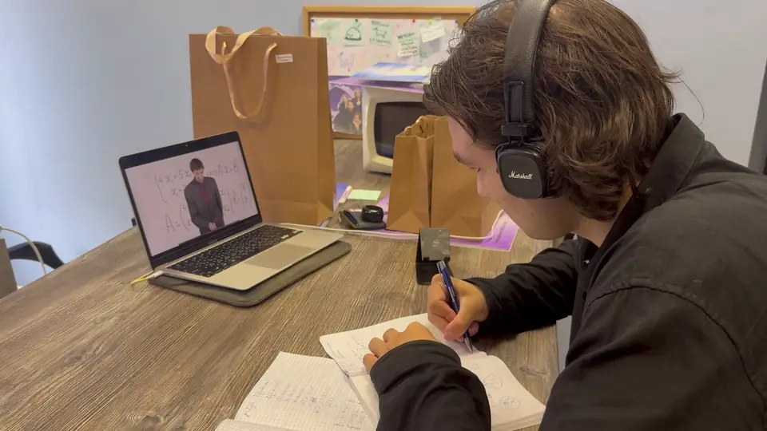
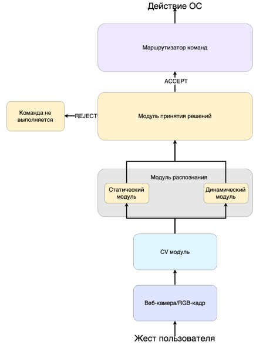
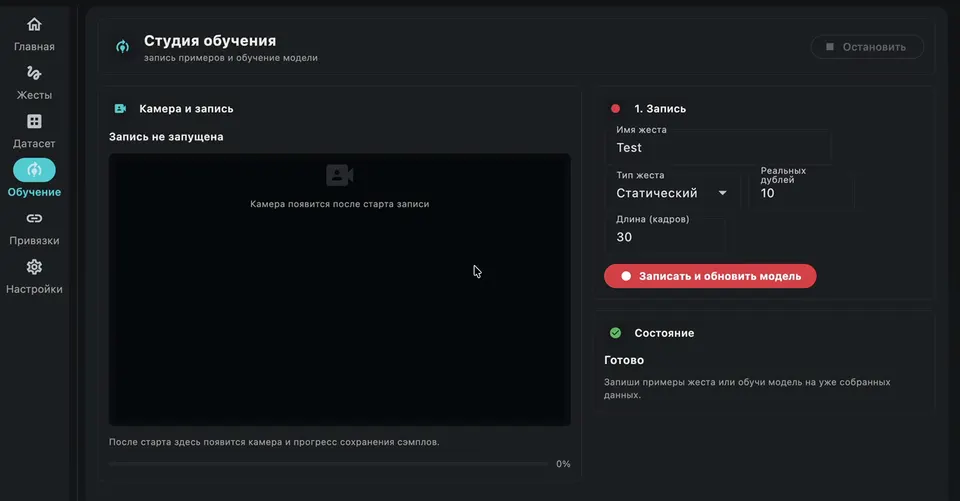
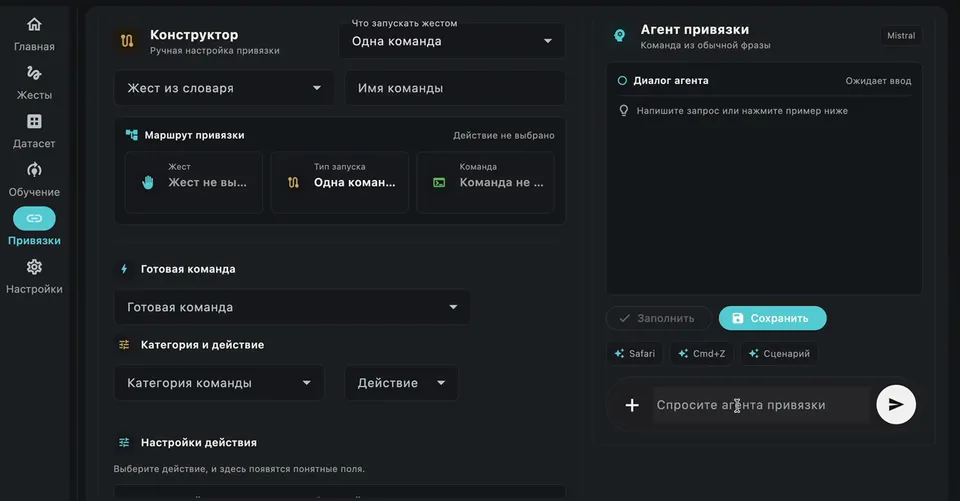

# GestureBind

> Локальное desktop-приложение, которое обучается жестам пользователя и
> превращает их в команды для компьютера. Текущий стабильный релиз предназначен
> для macOS; поддержка Windows находится в активной разработке.

[](https://github.com/Rafaildavar/GestureBind/actions/workflows/ci.yml?query=branch%3Acontest_version)
[](https://github.com/Rafaildavar/GestureBind/actions/workflows/ml-smoke.yml?query=branch%3Acontest_version)
[](https://github.com/Rafaildavar/GestureBind/releases)
[](LICENSE)

<p align="center">
  
</p>

<p align="center"><sub>Продуктовый сценарий: переключение учебных материалов жестами без мыши.</sub></p>

GestureBind использует обычную веб-камеру как персональный слой управления:
пользователь записывает собственные жесты одной рукой, обучает локальные модели,
проверяет распознавание в реальном времени и связывает жесты с системными
командами. Кадры камеры, landmarks и записи жестов обрабатываются локально и не
передаются во внешние сервисы. Опциональные сетевые функции описаны отдельно в
разделе [«Безопасность и приватность»](#безопасность-и-приватность).

GestureBind MVP `0.8.1` сейчас является release candidate поверх опубликованного
`v0.8.0`. Нативный macOS bundle, opt-in telemetry и одноручный режим уже
находятся в коде; tag `v0.8.1` будет создан после финальной проверки.

[Релизы](https://github.com/Rafaildavar/GestureBind/releases) ·
[Платформы](#поддержка-платформ) ·
[Безопасность](#безопасность-и-приватность) ·
[Требования](#системные-требования) ·
[Актуальный интерфейс](#актуальный-интерфейс) ·
[Быстрый старт](#быстрый-старт) ·
[Инструкция пользователя](docs/USER_GUIDE.md) ·
[Для программистов](#для-программистов)

## Что уже работает

| Возможность | Реализация                                                                   |
|---|------------------------------------------------------------------------------|
| Полный desktop-поток | единый Flet-интерфейс для камеры, записи, обучения, проверки и привязок      |
| Персональные жесты | статические позы и динамические движения, записанные самим пользователем     |
| Режим ввода | одна рука; двуручная запись и обучение после стабильного фидбэка             |
| Локальное ML | static tree classifier и dynamic landmark LSTM с open-set rejection          |
| Команды macOS | hotkeys, media, navigation, запуск приложений и последовательности действий  |
| Агент привязок | разбирает обычную фразу и формирует проверяемый черновик привязки            |
| Защита от ошибок | confidence gate, completion gate, negative classes и cooldown                |
| Локальные данные | SQLite по умолчанию, PostgreSQL опционально, камера не отправляется в облако |
| Контроль качества | live evaluation, обратная связь, JSONL, MLflow и opt-in daily telemetry      |
| Доставка | macOS DMG, резервный ZIP с `GestureBind.app` и tracked source bundle |

## Поддержка платформ

| Платформа            | Статус | Текущий этап |
|----------------------|---|---|
| macOS                | **Поддерживается** | полный пользовательский поток, системные команды и готовый `GestureBind.app` |
| Windows              | **Активная разработка** | адаптация системных действий, Windows CI и подготовка нативной сборки |
| Системная интеграция | **Следующий этап** | перенос начнётся после стабилизации и приёмочного тестирования Windows-версии |

Архитектура UI, камеры и ML-пайплайна изначально остаётся переносимой. Каждая
новая ОС получит статус поддерживаемой только после отдельной проверки камеры,
обучения, распознавания, выполнения команд и сборки установочного артефакта.

## Безопасность и приватность

Основной цикл GestureBind работает на компьютере пользователя: камера,
извлечение landmarks, запись примеров, обучение и распознавание не требуют
облачного сервера. Персональный датасет не включается в release-артефакты и не
попадает в Git.

| Компонент | Что происходит с данными |
|---|---|
| Камера | кадры обрабатываются в памяти локально и не загружаются в облако |
| Жесты и модели | записи, landmarks, названия классов и обученные модели хранятся локально |
| Команды и настройки | привязки, конфигурация, SQLite и runtime-логи остаются в `~/.dplm/` |
| Телеметрия | выключена по умолчанию; после явного согласия отправляет раз в сутки только обезличенные агрегаты качества и производительности |
| Агент привязок | beta не содержит встроенных API-ключей и по умолчанию работает локально; пользователь может выбрать LLM-провайдера или свой OpenAI-совместимый endpoint, тогда очищенный запрос и контекст текущей задачи передаются только выбранному сервису |
| Web research | выключен по умолчанию; при ручном включении агент может отправить текст поискового запроса DuckDuckGo и открыть только allowlisted-страницы Apple |

Телеметрия никогда не содержит кадры камеры, landmarks, записи, названия
пользовательских жестов, текст команд, пути к файлам, имена аккаунтов или
идентификаторы оборудования. Согласие можно отозвать в любой момент в
`Настройки -> Приватность`; при отключении анонимный installation ID
заменяется. Полный контракт приведён в [документе о телеметрии](docs/TELEMETRY.md).

Публичная macOS beta не содержит общих ключей LLM: MAS использует локальный
детерминированный pipeline, пока пользователь сам не выберет внешний сервис в
`Настройки -> MAS и LLM`. Для каждого провайдера личный API-ключ сохраняется в
отдельной записи системного Keychain; ключ собственного endpoint дополнительно
привязан к его серверу. Ключ не записывается в `config.json`, логи или
release-артефакты. Внешняя LLM не нужна для записи, обучения, распознавания и
ручного создания привязок. Передаваемый агенту
текст очищается от известных форматов ключей и токенов, но пользователю всё равно
не следует вводить в запросы пароли, персональные данные или секретные рабочие
сведения.

Команда выполняется только для сохранённой привязки, после прохождения
confidence/policy-проверок и при включённом переключателе `Выполнять команды`.
Низкая уверенность, неизвестный или незавершённый жест приводят к reject, а не к
запуску действия.

## Системные требования

Ниже указан практический профиль текущей beta-сборки, а не окончательный
аппаратный benchmark. Требования будут уточняться по результатам тестирования.

| Компонент | Beta minimum | Рекомендуется |
|---|---|---|
| ОС и процессор | macOS 14 Sonoma, Apple Silicon M1 | macOS 14 или новее, Apple Silicon M1/M2/M3/M4 |
| Оперативная память | 8 GB | 16 GB для частого переобучения моделей |
| Свободное место | 3 GB | 5 GB и больше для растущего датасета и логов |
| Камера | встроенная или USB-камера 720p | 1080p, стабильные 30 FPS и равномерное освещение |
| Интернет | нужен для скачивания beta-сборки | не нужен для основного локального цикла; требуется только опциональным сетевым функциям |
| Разрешения macOS | Camera | Accessibility дополнительно для hotkeys, управления курсором и автоматизации приложений |

Текущий CI собирает приложение на Apple Silicon. Отдельный Intel-артефакт пока
не публикуется, поэтому Mac на Intel не входит в поддерживаемый beta-профиль.


## Как это работает

<p align="center">
  
</p>

1. Пользователь записывает несколько независимых дублей жеста одной рукой.
2. Приложение обучает только классы из локального пользовательского датасета.
3. Static и dynamic маршруты проверяются раздельно в live-режиме.
4. Низкая уверенность, неизвестное движение и незавершённый жест отклоняются.
5. Привязанная команда выполняется только после policy-проверок и cooldown.

## Актуальный интерфейс

### Запись персонального жеста

Студия обучения записывает независимые дубли жеста одной рукой и показывает
landmarks, текущий дубль и общий прогресс прямо в окне приложения.

<p align="center">
  
</p>

### MAS-агент привязок

Пользователь описывает нужное действие обычной фразой. MAS проверяет запрос,
сопоставляет жест и системную команду, возвращает структурированный результат и
заполняет конструктор привязки. Тестовый запуск выполняется отдельно, а
сохранение готовой привязки остаётся явным решением пользователя.

По умолчанию MAS работает локально. Для модельного режима откройте
`Настройки -> MAS и LLM`, выберите OpenAI, Claude, Gemini, Mistral, OpenRouter,
Groq, DeepSeek, Ollama или свой OpenAI-совместимый API. Проверьте endpoint,
укажите идентификатор модели и личный ключ, затем нажмите `Сохранить` и
`Проверить`. Ключ можно удалить там же.

<p align="center">
  
</p>

## Быстрый старт

### Установка beta на macOS

Актуальная beta публикуется в двух форматах: DMG для обычной установки и
резервный ZIP с тем же `GestureBind.app`.

1. Откройте [GitHub Releases](https://github.com/Rafaildavar/GestureBind/releases)
   и раскройте `Assets` у актуальной beta-версии.
2. Скачайте `GestureBind-macos-<version>.dmg`, а не `Source code`.
3. Откройте DMG и перетащите `GestureBind.app` на ярлык `Applications`.
4. Дождитесь копирования, извлеките DMG и откройте приложение из `Applications`.
   Не запускайте приложение прямо из смонтированного образа.
5. При первом запуске нажмите на GestureBind
   правой кнопкой и выберите `Open`.
6. Разрешите доступ к камере. Для hotkeys и управления курсором отдельно
   разрешите GestureBind в `System Settings -> Privacy & Security -> Accessibility`.

В установочном образе также находятся `INSTALL.txt`, `USER_GUIDE.md` и
`README.md`: их можно открыть прямо из DMG до установки приложения.

Если macOS пишет, что программу не удаётся проверить на наличие вредоносного
ПО, откройте `System Settings -> Privacy & Security`, нажмите `Open Anyway`
рядом с сообщением о GestureBind, подтвердите вход и выберите `Open`. Текущая
beta пока не notarized; не отключайте Gatekeeper через Terminal.

Если DMG недоступен, используйте `GestureBind-macos-<version>.zip`: распакуйте
его и перенесите `.app` в `Applications`. Python и установка зависимостей для
готовой сборки не нужны. Подробный первый запуск, запись жеста, создание
привязки и устранение проблем описаны в
[инструкции пользователя](docs/USER_GUIDE.md).

### Запуск из исходного кода

Версию из исходного кода можно запустить на macOS с Python `3.11`. Инструкции
для Windows появятся после завершения активной разработки и приёмочного
тестирования этой платформы.

```bash
git clone https://github.com/Rafaildavar/GestureBind.git
cd GestureBind

python3.11 -m venv .venv
source .venv/bin/activate
python -m pip install --upgrade pip
python -m pip install -r requirements.txt
```

Для разработки и тестов:

```bash
python -m pip install -r requirements-dev.txt
```

TensorFlow нужен только для исторического CNN benchmark:

```bash
python -m pip install -r requirements-research.txt
```

Запуск desktop-приложения:

```bash
./scripts/launch_app.sh
```

Эквивалентная команда:

```bash
PYTHONDONTWRITEBYTECODE=1 python -B -m app.flet_app.main
```

SQLite используется автоматически и не требует Docker. Для PostgreSQL:

```bash
docker compose up -d db
export DPLM_DB_BACKEND=postgres
```

При первом запуске macOS запросит доступ к камере. Для выполнения hotkeys и
управления курсором также может понадобиться Accessibility permission.

Анонимная статистика качества выключена по умолчанию. Управлять согласием можно
в `Настройки -> Приватность`; подробности находятся в разделе
[«Безопасность и приватность»](#безопасность-и-приватность).

## Production ML

MediaPipe извлекает `21 x xyz` landmarks руки. Для static-жестов используются
полные pairwise distances, углы пальцев и временные агрегаты. Dynamic LSTM
получает нормализованную последовательность `72 x 22 x 3` и сохраняет
глобальную траекторию, необходимую для направленных движений.
Release auto-router принимает static-предсказания от `0.80`, а dynamic — от
`0.90`; порог выполнения привязанной команды остается отдельным барьером.

Перед нормализацией амплитуды dynamic-пайплайн проверяет, завершён ли жест.
Для каждого пользовательского класса verifier автоматически обучается на его
полных записях, собственных префиксах и префиксах остальных классов. Если
кандидат отклонён, сегментатор сохраняет уже выполненную часть и ждёт
продолжения, не испуская команду по неподвижному неполному жесту.

<details>
<summary><strong>Evidence snapshot от 10.07.2026 и результаты controlled live-проверок</strong></summary>

Static benchmark, production dynamic-модель, replay и model-stage latency
зафиксированы для текущего bundle. Static CV показывает качество последнего
сравнения кандидатов на source-grouped split, а controlled live-протокол
показывает поведение приложения с веб-камерой. Одноручный режим записи и
обучения был зафиксирован `11.07.2026`; отдельный controlled live-прогон после
этого UX-изменения ещё не повторялся.

Текущая release evidence:

| Проверка | Результат |
|---|---:|
| Static grouped CV benchmark accuracy (ExtraTrees, 13 классов) | `0.8708` |
| Static grouped CV benchmark macro F1 (ExtraTrees, 13 классов) | `0.7600` |
| Dynamic grouped validation accuracy | `0.8571` |
| Dynamic prototype positive recall | `0.9333` |
| Dynamic negative false-positive rate | `0.0000` |
| Dynamic ML latency, mean / p95 | `13.979 / 16.013 ms` |
| Completion gate, full source recordings | `60/60 = 1.0000` |
| Completion gate, prefix accepts before / after | `214/240 / 6/240` |
| Online state-machine replay, full / wrong class | `59/60 / 0` |
| Online state-machine replay, prefix false accepts | `5/240 = 0.0208` |
| Post-gate controlled live static recall at threshold `0.80` | `20/20 = 1.0000` |
| Post-gate controlled live dynamic recall at threshold `0.90` | `38/40 = 0.9500` |
| Post-gate positive total / wrong class | `58/60 = 0.9667 / 0` |
| Partial/look-alike false-command rate | `1/20 = 0.0500` |
| Background/no-command false-command rate | `0/30 = 0.0000` |
| Aggregate safety false-command rate | `1/50 = 0.0200` |

Post-gate live breakdown при release-пороге `0.90`: `SwipeLeft 20/20`,
`diagonal 9/10` (`1` пропуск), `zoom 9/10` (`1` пропуск). Неверных
dynamic-классов в этом прогоне не отмечено.
Static benchmark построен на `480` записях из `260` независимых source groups;
он нужен для сравнения static-пайплайнов, а не заменяет webcam live-проверку.
Результат controlled live относится к персональному протоколу: рука полностью в
кадре, а форма и траектория соответствуют записанному жесту. Offline-метрики
нужны для сравнения моделей, но не заменяют webcam-проверку и отдельный
`no-command` safety run.
Completion replay использует текущие source recordings через production
`GestureOnlineInfer`; это regression evidence, а не независимый test set.
Webcam positive и safety runs после gate выполнены. Partial/look-alike движения
дали `1/20` ложную команду, а background/no-command сценарии не дали ни одной
команды в `30` попытках. Оба показателя проходят release target `<=10%`.

</details>

## Архитектура

```text
app/flet_app/                 Flet UI и composition root
app/services/                 policies, команды, конфигурация и domain services
app/models/                   persistence и database adapter
app/gesture_online_infer.py   online CV/ML coordinator
cv/                           признаки, augmentation, обучение и модели
configs/                      taxonomy и versioned contracts
models/                       только allowlisted production bundle
scripts/                      smoke, benchmark и maintenance commands
tests/                        unit/integration contracts
docs/                         curated product, ML и operations docs
```

Полная схема слоев, runtime sequence, training publication и ownership данных:
[ARCHITECTURE.md](ARCHITECTURE.md).

## Локальные данные

| Данные | Расположение |
|---|---|
| Конфигурация | `~/.dplm/config.json` |
| SQLite | `~/.dplm/dplm.sqlite` |
| Runtime logs | `~/.dplm/logs/` |
| Daily telemetry state | `~/.dplm/logs/telemetry_state.json` |
| Samples в source checkout | `data/gestures/` или настроенный путь |
| MLflow | `mlflow.db`, `mlruns/` |

Эти пути исключены из Git. В `models/` отслеживается только production bundle,
нужный для первого запуска и smoke validation.

## Для программистов

Технические команды, release contract, внутренние документы и ограничения MVP
собраны здесь, чтобы пользовательская часть README оставалась короткой.

### Проверки

```bash
# Чистота tracked-дерева и release contract
PYTHON=.venv/bin/python make repo-hygiene

# Unit/integration tests + ML artifact smoke
PYTHON=.venv/bin/python make ci

# Только production model smoke
PYTHON=.venv/bin/python make ml-smoke

# Full/prefix benchmark через production dynamic state machine
python -m scripts.evaluate_dynamic_completion --log-mlflow

# Локальный MLflow UI
PYTHON=.venv/bin/python make mlflow-ui
```

MLflow открывается на [http://127.0.0.1:5000](http://127.0.0.1:5000).

### Release

GitHub release workflow создает три артефакта:

- `gesturebind-v0.8.1.tar.gz` с tracked source/model файлами;
- `GestureBind-macos-v0.8.1.dmg` с `GestureBind.app` и ярлыком `Applications`;
- `GestureBind-macos-v0.8.1.zip` как резервный способ установки.

Source bundle создается через `git archive`, поэтому он не может случайно
захватить `.env`, датасет, локальную БД или experiment outputs. macOS bundle
собирается на GitHub-hosted macOS runner, проходит ML smoke и затем упаковывается
в DMG и ZIP. Оба формата содержат пользовательскую инструкцию.

Статус `v0.8.1`: **release candidate**. Базовая positive matrix: `58/60`, wrong
class `0`; safety matrix: `49/50` безопасных отклонений, background false
commands `0/30`. После перехода на одноручный MVP требуется повторить финальный
controlled live-прогон, не меняя frozen production-модели.

Перед публикацией:

1. выполнить `make ci`;
2. пройти live static/dynamic/no-command matrix;
3. проверить `VERSION`, `CHANGELOG.md` и `RELEASE_NOTES.md`;
4. создать tag `v0.8.1` после ручной проверки текущего commit.

### Документация

- [Инструкция пользователя](docs/USER_GUIDE.md)
- [Architecture](ARCHITECTURE.md)
- [Training Workflow](docs/TRAINING_WORKFLOW.md)
- [Binding Rules](docs/BINDING_RULES.md)
- [Database Schema](docs/DB_SCHEMA.md)
- [CI/CD](docs/CI_CD.md)
- [Daily Usage Telemetry](docs/TELEMETRY.md)

### Ограничения MVP

- официальный release bundle и production command execution пока подтверждены
  только на macOS; Windows находится в активной разработке, остальные системы
  будут рассматриваться после её платформенного тестирования;
- запись, обучение и пользовательский интерфейс текущего MVP работают только с
  одной рукой; двуручные семплы временно отклоняются;
- приложение пока не подписано Developer ID и не notarized;
- качество новых пользовательских классов зависит от разнообразия записей;
- публичные benchmark datasets используются как исследовательская проверка, а
  не как замена персональному датасету;
- `AppController` остается крупным composition root; новая domain-логика должна
  выноситься в `app/services` или `cv`.

## License

MIT. See [LICENSE](LICENSE).
