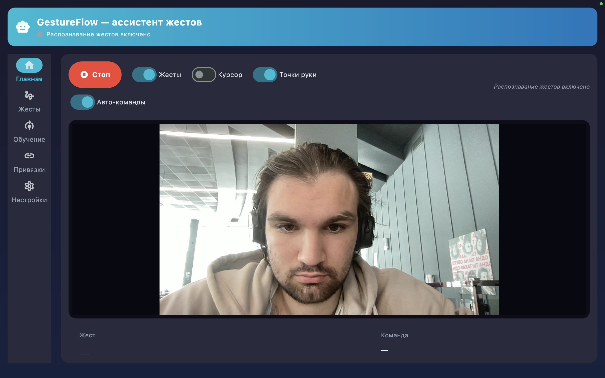
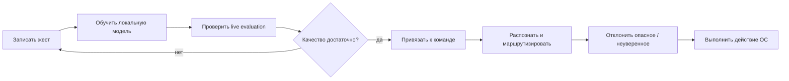
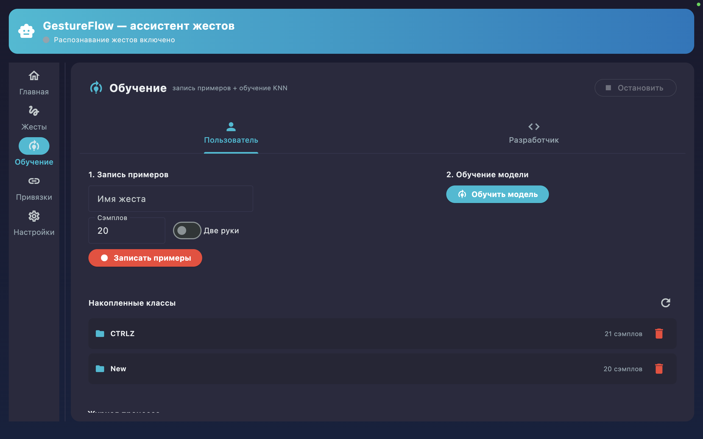
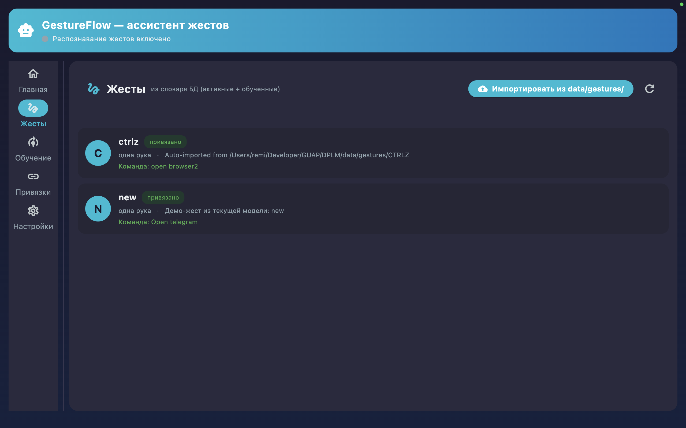
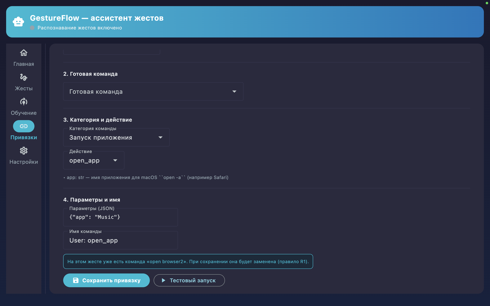
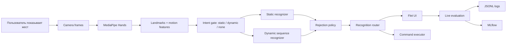

# GestureBind

> Персональная ML-система для управления компьютером жестами: пользователь
> записывает свои жесты через веб-камеру, обучает модели, проверяет качество
> в live-evaluation и привязывает распознанные жесты к безопасным командам ОС.

[](https://github.com/Rafaildavar/GestureBind/actions/workflows/ci.yml)
[](https://github.com/Rafaildavar/GestureBind/actions/workflows/ml-smoke.yml)
[](https://github.com/Rafaildavar/GestureBind/actions/workflows/docker-runtime.yml)
[](https://github.com/Rafaildavar/GestureBind/actions/workflows/desktop-release.yml)
[](LICENSE)

<p align="center">
  
</p>

<p align="center">
  <b>Train personal gestures, evaluate live quality, and bind reliable camera gestures to safe desktop actions.</b>
</p>

<p align="center">
  <a href="#что-это">Overview</a> ·
  <a href="#скриншоты">Screenshots</a> ·
  <a href="#ml-pipeline">ML Pipeline</a> ·
  <a href="#command-binding">Command Binding</a> ·
  <a href="#быстрый-старт">Quick Start</a>
</p>

<table>
  <tr>
    <td align="center"><b>0.8000</b><br>Static CV accuracy</td>
    <td align="center"><b>0.9472</b><br>Dynamic-like F1</td>
    <td align="center"><b>1.0000</b><br>Negative reject benchmark</td>
    <td align="center"><b>0.731</b><br>Live evaluation accuracy</td>
  </tr>
</table>

## Что Это

GestureBind превращает обычную веб-камеру в персональный слой управления
desktop-сценариями. Вместо заранее прошитого набора жестов пользователь сам
собирает примеры, обучает локальные модели, проверяет качество распознавания в
live-режиме и привязывает надежные жесты к действиям в рабочем окружении.

Проект сделан как end-to-end ML Engineering система, а не как notebook-демо:
здесь есть сбор данных, feature extraction, static/dynamic gesture pipelines,
rejection policy, безопасное исполнение команд, desktop UI, MLflow tracking,
Docker smoke checks, CI/CD и сборка release-артефактов.

**English version:** [README_EN.md](README_EN.md)

## Зачем Нужен Проект

Горячие клавиши быстрые, но их нужно помнить. Голосовые команды не всегда
уместны. Отдельные контроллеры требуют дополнительного устройства. GestureBind
исследует третий вариант: небольшие персональные жесты с камеры, которые можно
обучить, проверить и безопасно использовать в рабочем окружении.

Подходящие сценарии:

- быстрые команды для разработчиков, дизайнеров, монтажеров, стримеров и спикеров;
- accessibility-сценарии, где жест удобнее клавиатуры или мыши;
- управление медиа, окнами, браузером, презентациями и рабочими пайплайнами;
- HCI/CV-эксперименты с воспроизводимым ML-пайплайном.

## Ключевые Возможности

| Область | Что реализовано |
|---|---|
| Desktop app | Flet UI для recognition, gesture library, training, bindings, settings, diagnostics и assistant panel |
| Сбор данных | Запись жестов с веб-камеры в `.npy` samples с metadata и quality signals |
| Static gestures | Hand landmarks, crafted geometry features, ExtraTrees/SVM/KNN baselines, rejection policies |
| Dynamic gestures | Sequence features, wrist motion, direction-sensitive gestures, prototype и temporal-model experiments |
| Training loop | Обучение из UI, безопасная GISLR-style augmentation, Optuna support |
| Live evaluation | Expected-label тесты: correct, wrong, missed, confidence, confusion, JSONL logs |
| Command binding | Desktop actions, hotkeys, media keys, scroll/navigation, app launch, scripts, multi-step sequences |
| Safety | Confidence threshold, cooldown, negative classes, open-set policy, command validation, dangerous-action warnings |
| MLOps | MLflow runs, experiment reports, generated figures, dashboard exports, model smoke checks |
| Delivery | GitHub Actions, Docker runtime image, release bundle, desktop packaging workflow |

## Product Flow



1. Пользователь открывает desktop app и включает camera recognition.
2. Записывает static или dynamic gesture examples.
3. Обучает модель из UI или CLI.
4. Запускает live evaluation с expected label.
5. Смотрит accuracy, missed events, wrong labels, confidence и rejection.
6. Привязывает надежный жест к команде или sequence.
7. Команда выполняется только после routing и safety policy.

## Скриншоты

<table>
  <tr>
    <td width="50%">
      
    </td>
    <td width="50%">
      
    </td>
  </tr>
  <tr>
    <td align="center"><b>Live recognition</b></td>
    <td align="center"><b>Training workflow</b></td>
  </tr>
  <tr>
    <td width="50%">
      
    </td>
    <td width="50%">
      
    </td>
  </tr>
  <tr>
    <td align="center"><b>Gesture library</b></td>
    <td align="center"><b>Command bindings</b></td>
  </tr>
</table>

## Архитектура



Основные модули:

```text
app/flet_app/              desktop UI and controller layer
app/gesture_online_infer.py online inference and gesture routing
app/services/              command execution, config, diagnostics, binding policy
app/models/                SQLAlchemy models and database access
cv/                        feature extraction, training, augmentation, sequence models
scripts/                   experiments, reports, dashboards, smoke checks
models/                    tracked model artifacts and metadata
docs/                      architecture, CI/CD, experiments, generated figures
tests/                     unit and integration tests
.github/workflows/         CI, ML smoke, Docker runtime, release workflows
```

Подробнее: [docs/GESTUREBIND_MAS_ARCHITECTURE.md](docs/GESTUREBIND_MAS_ARCHITECTURE.md),
[docs/DB_SCHEMA.md](docs/DB_SCHEMA.md), [docs/CI_CD.md](docs/CI_CD.md).

## ML Pipeline

GestureBind использует MediaPipe Hands как landmark extractor, а решение о
жесте принимает локальный ML-пайплайн поверх нормализованной геометрии руки и
motion features.

### Формат данных

```text
data/gestures/<label>/sample_*.npy
data/gestures/<label>/sample_*.meta.json
configs/gesture_taxonomy.json
```

Поддерживаемые feature layouts:

- `42`: одна рука, `21 x xy`;
- `44`: одна рука, `21 x xy + wrist_xy`;
- `63`: одна рука, `21 x xyz`;
- `65`: одна рука, `21 x xyz + wrist_xy`.

Training code сохраняет совместимость со старыми `42/44` samples и при
необходимости приводит их к новым `63/65` layouts.

### Модели и признаки

- static landmarks и crafted geometry features;
- dynamic statistics и wrist trajectory features;
- KNN, SVM, ExtraTrees, RandomForest, Logistic Regression baselines;
- sequence MLP, LSTM/GRU backbone, Rocket, MultiRocket, SProcket, Shapelet, PhaseHMM experiments;
- negative classes и open-set rejection policies;
- intent gate для routing в `static`, `dynamic` или `none`.

### Текущие доказательства качества

| Отчет | Результат | Почему важно |
|---|---:|---|
| [Static CV benchmark](docs/experiments/static_cv_benchmark.md) | `static_landmark_image + extra_trees`: accuracy `0.8000`, macro F1 `0.7389` на `260` samples / `10` classes | Текущий mixed dataset с augmentation и negative-like labels |
| [Static rejection benchmark](docs/experiments/static_rejection_benchmark_craft_extratrees.md) | `negative_classes`: positive recall `1.0000`, negative FP `0.0000`, accepted accuracy `1.0000` | Для команд ОС важен reject, а не только classification accuracy |
| [Threshold report](docs/experiments/threshold_report.md) | `static_stats + svm`, threshold `0.50`: accepted accuracy `1.0000`, coverage `0.9587` | Показывает trade-off между точностью и долей принятых предсказаний |
| [Model comparison](docs/experiments/model_comparison.md) | `dynamic_stats + extra_trees`: macro F1 `0.8136`, dynamic-like F1 `0.9472` | Baseline для direction-sensitive и temporal gestures |
| [Live evaluation](docs/experiments/live_evaluation_report.md) | `52` attempts, accuracy `0.731`; completed run для `swipe_up` достиг `1.000` | Реальная webcam-метрика отделена от offline CV |

Проект намеренно хранит и offline, и live metrics. Offline CV полезен для
сравнения feature/model choices; live evaluation важнее для продукта, потому
что учитывает шум камеры, timing, missed detections и false triggers.

## Command Binding

GestureBind поддерживает одиночные действия и многошаговые сценарии:

```json
{
  "action": "sequence",
  "steps": [
    {"action": "open_app", "app": "Browser"},
    {"action": "wait", "seconds": 1.0},
    {"action": "notify", "title": "GestureBind", "message": "Workspace ready"}
  ]
}
```

Поддерживаемые действия:

- `open_app`, `open_url`, `open_path`;
- `volume_up`, `volume_down`, `mute_toggle`;
- `brightness_up`, `brightness_down`, `lock_screen`, `screenshot`;
- `scroll`, `press`, `media_key`, `key_combination`;
- `run_script`;
- `wait`, `notify`, `sequence`.

Safety rules:

- команда выполняется только выше confidence threshold;
- cooldown на каждый жест защищает от повторных срабатываний;
- один активный command binding на один gesture;
- validation для script paths и action specs;
- warning для dangerous actions: `lock_screen`, `run_script`;
- nested sequences запрещены.

Подробнее: [docs/BINDING_RULES.md](docs/BINDING_RULES.md).

## Быстрый Старт

GestureBind ориентирован на локальное desktop-использование. Рекомендуется
Python `3.11`.

```bash
git clone https://github.com/Rafaildavar/GestureBind.git
cd GestureBind

python3.11 -m venv .venv
source .venv/bin/activate
python -m pip install --upgrade pip
python -m pip install -r requirements.txt
```

Запустить базу и seed-данные:

```bash
docker compose up -d db
PYTHONDONTWRITEBYTECODE=1 python -B -m scripts.seed_database
```

Запустить desktop app:

```bash
PYTHONDONTWRITEBYTECODE=1 python -B -m app.flet_app.main
```

Прогнать основные проверки:

```bash
PYTHON=.venv/bin/python make ci
PYTHON=.venv/bin/python make ml-smoke
```

## Полезные Команды

```bash
# Unit tests
PYTHON=.venv/bin/python make test-unit

# ML artifact smoke check
PYTHON=.venv/bin/python make ml-smoke

# Model comparison reports
PYTHON=.venv/bin/python make compare-models
PYTHON=.venv/bin/python make threshold-report
PYTHON=.venv/bin/python make rejection-benchmark

# MLOps dashboard and MLflow
PYTHON=.venv/bin/python make mlops-dashboard
PYTHON=.venv/bin/python make mlflow-ui

# Docker runtime checks
make docker-build
make docker-ml-smoke
make docker-ci

# Desktop release bundle
make desktop-release
```

MLflow UI доступен локально:

```text
http://127.0.0.1:5000
```

## Docker И Release Artifacts

Docker используется как воспроизводимый headless runtime для ML smoke checks,
MLOps и CI/CD. Это не основной способ раздавать интерактивное desktop-приложение
с камерой.

Docker image собирается как `linux/amd64`, потому что нужные MediaPipe wheels
доступны для Linux x86_64. PyTorch ставится из CPU-only wheels, чтобы runtime
не тянул CUDA-зависимости в webcam/desktop проект.

Для пользовательской доставки есть desktop release workflow: он собирает
архив приложения и публикует `.zip` artifact. Текущие артефакты предназначены
для demo/testing; production-релизу еще нужны полноценная подпись, проверка
установки и понятный onboarding для выдачи разрешений камере.

## Tech Stack

| Слой | Инструменты |
|---|---|
| Desktop UI | Flet, legacy PySide/Qt components |
| Computer vision | OpenCV, MediaPipe Hands |
| ML | scikit-learn, NumPy, SciPy, PyTorch experiments, Optuna |
| Data and storage | `.npy`, JSON metadata, SQLAlchemy, PostgreSQL, SQLite fallback |
| MLOps | MLflow, JSONL runtime logs, generated reports, dashboard exports |
| Automation | Makefile, Docker, GitHub Actions, PyInstaller/Flet packaging |
| Testing | pytest, unit tests, integration smoke tests, model artifact smoke tests |

## Документация

- [Training Workflow](docs/TRAINING_WORKFLOW.md)
- [Binding Rules](docs/BINDING_RULES.md)
- [CI/CD](docs/CI_CD.md)
- [Database Schema](docs/DB_SCHEMA.md)
- [Experiments Index](docs/experiments/README.md)
- [Voice Assistant Guide](docs/VOICE_ASSISTANT_GUIDE.md)

## Roadmap

- улучшить segmentation и end-of-gesture detection для dynamic gestures;
- расширить live datasets для direction-sensitive gestures;
- калибровать thresholds через больше webcam-сессий, а не только offline CV;
- довести desktop artifact до production-grade signing и release QA;
- добавить richer release assets с model metrics и dashboard snapshots;
- дальше отделять product UI flows от developer-only diagnostics.

## Статус Проекта

Стабильно для demo:

- Flet desktop UI;
- запись жестов и обучение моделей;
- gesture-to-command binding;
- live evaluation;
- MLflow и CI smoke checks;
- static gesture recognition и dynamic baseline experiments;
- Docker и desktop artifact workflows.

В активной разработке:

- более сложные dynamic gestures;
- negative/live false-positive calibration;
- release signing и install QA;
- larger public benchmark datasets.

## License

MIT. See [LICENSE](LICENSE).

## Автор

Rafail Davar

GestureBind развивается как open-source ML/HCI-проект для экспериментов с
персональным распознаванием жестов и безопасным desktop interaction.
