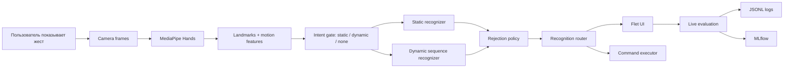

# GestureFlow

> Персональная ML-система для управления компьютером жестами: пользователь
> записывает свои жесты через веб-камеру, обучает модели, проверяет качество в
> live-evaluation и привязывает распознанные жесты к командам ОС.

[](https://github.com/Rafaildavar/DPLM/actions/workflows/ci.yml)
[](https://github.com/Rafaildavar/DPLM/actions/workflows/ml-smoke.yml)
[](https://github.com/Rafaildavar/DPLM/actions/workflows/desktop-release.yml)

## Что Это

GestureFlow - desktop MVP и ML Engineering проект для распознавания
пользовательских жестов по обычной веб-камере.

Главная идея: жесты не должны быть заранее жестко прошиты в приложении.
Пользователь может:

- записать собственный статический или динамический жест;
- переобучить модель из интерфейса;
- проверить реальные live-метрики на камере;
- привязать жест к действию: открыть приложение, нажать горячие клавиши,
  выполнить сценарий из нескольких шагов, показать уведомление или запустить
  безопасный пользовательский скрипт.

Проект сделан как полноценная система, а не как notebook-классификатор:
есть сбор данных, предобработка, модели, reject policy, online inference,
MLOps-логирование, live-evaluation, CI/CD и продуктовый интерфейс.

## Почему Это Важно

Обычные горячие клавиши нужно помнить, голос не всегда уместен, а отдельные
контроллеры требуют дополнительного устройства. GestureFlow дает более
персональный способ управления рабочим окружением: пользователь сам задает
жесты, проверяет их качество и связывает с нужными командами.

Потенциальные сценарии:

- быстрые команды для разработчиков, дизайнеров, монтажеров и стримеров;
- accessibility-сценарии, где жест удобнее клавиатуры или мыши;
- управление презентациями, медиа, окнами и рабочими сценариями;
- HCI/CV-исследования с воспроизводимым ML-пайплайном.

## Ключевые Возможности

| Область | Что реализовано |
|---|---|
| Запись данных | Запись жестов из Flet-интерфейса, сохранение `.npy` samples и metadata |
| Статические жесты | Распознавание поз руки, negative-классы, rejection policy |
| Динамические жесты | Sequence-модели, сегментация движения, natural end-of-gesture policy |
| Пользовательское обучение | Обучение моделей из UI без ручного запуска CLI |
| Live evaluation | Тесты по expected label: correct, wrong, missed, accuracy, confusion |
| Команды ОС | Привязка жестов к действиям, hotkeys, media keys, сценариям `sequence` |
| MLOps | MLflow runs, JSONL logs, HTML dashboard, артефакты экспериментов |
| CI/CD | GitHub Actions: unit tests, ML smoke, release bundle |

## Где Здесь ML

GestureFlow использует MediaPipe Hands как CV-экстрактор landmark-точек, а
решение о жесте принимает собственный ML-пайплайн поверх этих данных.

### Данные

Вход модели - последовательности landmark-точек руки:

- static/quasi-static: положение кисти и пальцев в окне кадров;
- dynamic: временной ряд `frames x features`, включая форму руки и global wrist
  motion;
- negative: движения и состояния, которые не должны запускать команды.

Основные данные лежат в:

```text
data/gestures/<label>/sample_*.npy
data/gestures/<label>/sample_*.meta.json
configs/gesture_taxonomy.json
```

### Модели

В проекте сравниваются и используются несколько подходов:

- static baseline: pose-based классификация статических жестов;
- dynamic sequence MLP;
- dynamic LSTM backbone для более сложных временных жестов;
- Rocket/MultiRocket/SProcket/Shapelet/PhaseHMM эксперименты для временных
  рядов;
- prototype/rejection layer для open-set поведения;
- intent gate `static / dynamic / none`, чтобы не заставлять классификатор
  выбирать жест там, где команды быть не должно.

Модель не должна просто выбирать ближайший класс. Для безопасного управления
ОС важны:

- confidence threshold;
- top1/top2 margin;
- distance-to-prototype;
- negative labels;
- live false positive rate;
- rejected/no-command outcomes.

### Метрики

Offline-метрики нужны, но главный критерий качества - поведение в live:

- accuracy, precision, recall, macro F1;
- per-class recall;
- false positive rate;
- dynamic-as-static confusion;
- missed rate;
- reject rate;
- latency и FPS;
- command success rate.

Live-тесты автоматически пишутся в JSONL и MLflow, чтобы каждую гипотезу можно
было проверить повторно.

## Архитектура



Основные модули:

```text
app/flet_app/              Flet desktop UI
app/gesture_online_infer.py online inference and routing
app/services/              commands, config, diagnostics, binding policy
app/models/                SQLAlchemy models
cv/                        feature extraction, training, sequence models
scripts/                   experiments, reports, MLOps utilities
models/                    tracked model artifacts and metadata
docs/contest/              JMLC-oriented ML system design
tests/                     unit and smoke tests
.github/workflows/         CI/CD pipelines
```

## Product Flow

1. Пользователь открывает приложение.
2. Включает камеру и live recognition.
3. Записывает новый жест или использует уже существующий.
4. Обучает модель из интерфейса.
5. Запускает live evaluation: выбирает expected label и делает 10-20 попыток.
6. Смотрит accuracy, wrong/missed, confusion и rejection outcomes.
7. Привязывает жест к команде или сценарию.
8. Система выполняет команду только после прохождения route + reject policy.

## Command Binding

GestureFlow поддерживает не только одиночные действия, но и сценарии:

```json
{
  "action": "sequence",
  "platform": "macos",
  "steps": [
    {"action": "open_app", "app": "Safari"},
    {"action": "wait", "seconds": 1.0},
    {"action": "notify", "title": "GestureFlow", "message": "Рабочее место готово"}
  ]
}
```

Поддерживаемые типы действий:

- `open_app`, `open_url`, `open_path`;
- `volume_up`, `volume_down`, `mute_toggle`;
- `brightness_up`, `brightness_down`, `lock_screen`, `screenshot`;
- `scroll`, `press`, `media_key`, `key_combination`;
- `run_script`;
- `wait`, `notify`, `sequence`.

Опасные действия дополнительно помечаются политикой безопасности. Вложенные
сценарии запрещены, чтобы не создавать неуправляемые цепочки.

## MLOps И Наблюдаемость

Проект фиксирует эксперименты и live-качество:

- MLflow: параметры обучения, метрики, артефакты моделей;
- `outputs/ci/ml_smoke_report.json`: проверка загрузки моделей в CI;
- `~/.dplm/logs/live_evaluation.jsonl`: попытки live-тестов;
- `~/.dplm/logs/runtime_performance.jsonl`: latency/FPS;
- `docs/contest/ML_SYSTEM_DESIGN.md`: living-документ архитектуры ML-системы;
- `docs/experiments/`: отчеты по гипотезам, rejection, datasets, thresholds.

Запуск MLflow UI:

```bash
PYTHON=.venv/bin/python make mlflow-ui
```

После запуска UI доступен локально:

```text
http://127.0.0.1:5000
```

## CI/CD

CI проверяет, что код и ML-артефакты не сломались после изменений:

```bash
PYTHON=.venv/bin/python make ci
```

В GitHub Actions:

- `CI`: unit tests + ML smoke на push/PR;
- `ML Smoke`: отдельная регулярная проверка model artifacts;
- `Desktop Release Bundle`: сборка release bundle по tag/manual run.

Текущий CD-подход для desktop-приложения: не деплой на сервер, а выпуск
воспроизводимого handoff bundle с кодом, моделями, конфигами и документацией.

Подробнее: [docs/CI_CD.md](docs/CI_CD.md).

## Быстрый Старт

### 1. Окружение

Рекомендуется Python 3.11.

```bash
git clone https://github.com/Rafaildavar/DPLM.git
cd DPLM

python3.11 -m venv .venv
source .venv/bin/activate
python -m pip install --upgrade pip
python -m pip install -r requirements.txt
```

### 2. База Данных

```bash
docker compose up -d db
PYTHONDONTWRITEBYTECODE=1 python -B -m scripts.seed_database
```

### 3. Приложение

```bash
PYTHONDONTWRITEBYTECODE=1 python -B -m app.flet_app.main
```

### 4. Проверки

```bash
PYTHON=.venv/bin/python make ci
PYTHON=.venv/bin/python make ml-smoke
```

## Как Тестировать Жесты

Для live-метрик:

1. Открой приложение.
2. Перейди в live evaluation.
3. Выбери expected label, например `swipe_up`.
4. Сделай 10-20 попыток естественным жестом.
5. Зафиксируй `correct`, `wrong`, `missed`, `accuracy`.
6. Повтори для negative/no-command сценариев.
7. Сравни результаты в MLflow и JSONL-логах.

Для динамических жестов важно показывать именно естественное движение, а не
`движение + удержание позы`. Система должна принимать решение по завершенному
сегменту движения, а не по финальной статической позе.

## Документация

- [JMLC overview](docs/contest/JMLC.md)
- [ML System Design](docs/contest/ML_SYSTEM_DESIGN.md)
- [CI/CD](docs/CI_CD.md)
- [Binding Rules](docs/BINDING_RULES.md)
- [Current Status](docs/CURRENT_STATUS.md)

## Почему Проект Подходит Для JMLC

### Разработка И Инженерия

- desktop MVP с реальным UX;
- GitHub Actions CI/CD;
- Docker/PostgreSQL слой;
- тесты сервисов, роутинга, команд и ML-контрактов;
- воспроизводимые CLI-команды;
- release bundle workflow.

### Data Science

- собственный датасет жестов;
- feature engineering для static/dynamic режимов;
- сравнение моделей временных рядов;
- negative examples и rejection;
- offline + live validation;
- MLflow и отчеты по гипотезам.

### Применение ИИ

- ML внутри продукта: gesture recognition, intent gate, sequence models;
- AI-assisted разработка: анализ гипотез, тест-кейсы, документация, code review;
- AI-агенты планируются как отдельный слой для помощи в routing, data quality и
  experiment analysis.

### Продуктовое Мышление

- понятная пользовательская проблема;
- MVP закрывает полный путь от записи жеста до команды ОС;
- есть live feedback loop;
- качество оценивается не только accuracy, но и безопасностью выполнения команд.

## Статус

Текущая рабочая ветка: `contest_version`.

Стабильно:

- Flet desktop app;
- запись и обучение жестов;
- command binding;
- live evaluation;
- MLflow/CI smoke;
- статические жесты и базовый dynamic pipeline.

В активной разработке:

- качество сложных динамических жестов;
- segmentation/end-of-gesture policy;
- LSTM/sequence model experiments;
- CD release bundle;
- более красивая витрина метрик для демонстрации.

## Автор

Rafail Davar

Проект развивается как конкурсная версия GestureFlow для Junior ML Contest и как
основа для дальнейшего ML/HCI-продукта.
