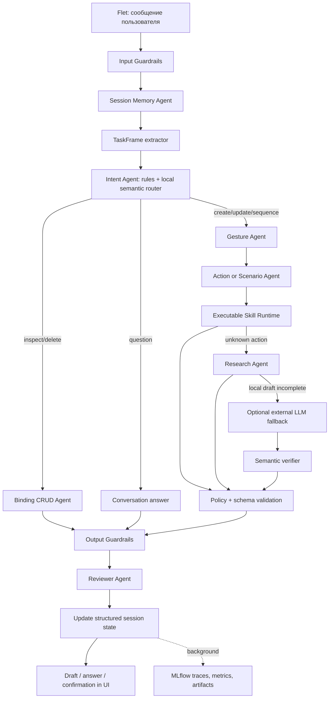

# GestureBind MAS architecture

Дата актуализации: 2026-07-09

Этот документ описывает многоагентную систему вкладки «Привязки»: как фраза
пользователя превращается в проверенный draft, ответ или подтверждаемую операцию
над существующей привязкой.

## Границы системы

MAS решает четыре класса задач:

1. Создание и изменение одиночной привязки.
2. Сборка сценария из нескольких действий.
3. Просмотр и удаление существующих привязок.
4. Ответы по GestureBind и мягкий redirect для вопросов вне проекта.

Агенты никогда не исполняют предложенный `actionSpec`. Исполнение остаётся в
`AppController`/`CommandExecutor` после явного пользовательского действия.

## End-to-end pipeline



## Contracts

### TaskFrame

`contracts.TaskFrame` is the normalized interpretation of one turn:

- `domain`: binding, project, general or guardrails;
- `operation`: create, update, delete, inspect, validate, sequence, answer,
  cancel;
- `intent`, `block`, `route`;
- `gesture_text`, `action_text`, `target_text`;
- `negated`, `sequence_requested`;
- confidence, evidence and ranked alternatives.

Rules handle high-precision phrases first. The local hybrid router compares the
request with intent examples using lexical features and character TF-IDF. A
small route margin causes abstention/clarification instead of forced routing.

### ActionCandidate

Every proposed action is compiled to `ActionCandidate` before it can become a
draft. The candidate records:

- normalized `actionSpec`;
- source and confidence;
- executable `skillId` and `skillVersion`;
- semantic evidence/issues;
- risk and `requiresConfirmation`.

`CandidateArbiter` accepts a valid high-margin candidate and abstains when
different actions are too close. This prevents, for example, `закрыть Telegram`
from silently turning into `open_app`.

### BindingAgentResult

The public result has one of these forms:

- ready `single`/`sequence` draft;
- clarification with exact `missing` fields;
- markdown `answer` without executable action;
- `mutation` that requires explicit confirmation;
- guardrail-blocked answer.

The compatibility method `to_legacy_draft()` is the only conversion needed by
the current Flet UI.

## Intents

Supported intents:

- `create_binding`;
- `update_binding`;
- `build_sequence`;
- `inspect_binding`;
- `delete_binding`;
- `cancel_binding`;
- `validate_command`;
- `project_question`;
- `unsupported_general_question`;
- `guardrail_block`.

Question form alone does not force answer mode. For example,
`можешь открыть Safari жестом palm?` remains a binding request.

## Gesture resolution

The Gesture Agent resolves in this order:

1. correction target after `не X, а Y` or `вместо X Y`;
2. exact known label in the current prompt;
3. gesture metadata and approved aliases;
4. unambiguous fuzzy candidate;
5. active task slot from structured memory;
6. currently selected gesture in the UI;
7. clarification.

An exact label beats a colliding alias. A newly named custom gesture produces a
pending `gestureAliasProposal`; the JSON registry is changed only after the
binding itself is saved successfully.

## Structured memory

`session_memory.py` stores one active binding task per UI session with TTL:

- task id and status;
- intent;
- gesture, actionSpec and command name;
- source binding id;
- missing slots and turn index.

Each turn is classified as `new_task`, `continuation` or `correction`. Only an
explicit continuation, a correction, or a response that fills a known missing
slot inherits values. Raw chat history is retained for tone/answer continuity,
but is not scanned for executable gesture/action parameters. Binding prompts
sent to an external LLM contain the sanitized `sessionState`, not the full dialog.

## Executable skills

`skills/runtime.py` owns executable skill manifests. A manifest defines:

- supported intents/actions and examples;
- input/output contracts;
- OS and required permissions;
- risk, timeout and semantic version.

The runtime selects a skill for each `actionSpec` and validates it with the same
schema used by `CommandExecutor`. Current skills cover apps, URL/path opening,
hotkeys, key presses, Spaces, page zoom, scroll, media, volume, brightness,
screen actions, notifications, waits, scripts and sequences.

Filesystem `skill_packs/*/SKILL.md` remain richer reasoning instructions. They
do not bypass executable skill validation.

## Research and learning lifecycle

Unknown actions use this order:

1. approved research memory;
2. built-in source-backed recipes;
3. optional allowlisted Apple web research;
4. selected OpenAI-compatible LLM fallback if the local contract is incomplete.

The same request can enter research only once. A discovered recipe must pass
platform, source, schema and semantic validation. It remains `pending` until a
successful user save, then `Skill Memory Writer` persists versioned provenance
to JSON and renders the human-readable `SKILL.md` view.

Live web research is opt-in and only accepts Apple Support/Developer pages.

## CRUD safety

`BindingCrudAgent` receives a snapshot from `AppController.list_db_commands()`.

- Inspect/list returns read-only markdown.
- Delete returns a `delete_binding` mutation with binding id.
- The UI changes the command button to «Удалить» and opens a confirmation
  dialog.
- Only the dialog confirmation calls `delete_db_command()`.

The model never receives a direct database mutation tool.

## Guardrails and reviewer

Input guardrails block secrets and prompt-injection patterns. Output guardrails
distinguish `clarify` from `block`: a missing gesture/action is a normal
clarification, not a refusal.

The reviewer checks semantic action alignment and scores:

- relevance;
- contract completeness;
- safety;
- tone;
- clarification quality.

Model output is not trusted: an explicit gesture from the prompt overrides a
different model gesture, and the action must pass semantic compilation again.

## Latency and privacy

One request shares a default 12-second budget:

- deterministic local stages run first;
- Apple research uses short bounded requests and at most one result page;
- the selected external LLM receives only the remaining budget, capped at 8 seconds;
- MLflow logging runs on a single background worker.

Secrets are redacted recursively before external LLM prompts, MLflow params,
artifacts, span inputs/outputs and trace metadata. Configure the total budget
with `DPLM_BINDING_AGENT_TIMEOUT_SECONDS`.

## MLflow

Runtime logging records:

- route method, semantic score and margin;
- skill ids/versions in step artifacts;
- per-step state and network duration;
- total latency and remaining budget;
- reviewer scores and confirmation requirement;
- redacted pipeline/draft artifacts and GenAI traces.

`DPLM_BINDING_AGENT_GENAI_EVAL=1` evaluates only prompts present in the golden
dataset. Expectations come from `eval_cases.py`, never from the current result.

## Evaluation

The golden set currently contains 32 cases across actions, aliases, scenarios,
abstention, questions, CRUD, cancellation and guardrails. The judge uses ten
criteria and supports a deterministic CI rubric or an independent Mistral call.

```bash
python scripts/evaluate_binding_agent_mas.py --judge local
python scripts/evaluate_binding_agent_mas.py --judge auto --mlflow
python scripts/evaluate_binding_agent_mas.py --judge mistral --output /tmp/mas-eval.json
```

`auto` uses Mistral when `MISTRAL_API_KEY` exists and otherwise falls back to
the deterministic rubric.

## Module map

| Module | Responsibility |
|---|---|
| `binding_agent.py` | Public facade, orchestrator and MLflow adapter |
| `contracts.py` | TaskFrame, candidate, context, step and result contracts |
| `task_frame.py` | Rule/semantic interpretation of a turn |
| `semantic_router.py` | Local hybrid intent similarity |
| `session_memory.py` | Task-scoped state and TTL store |
| `tools.py` | Gesture/action/sequence tools |
| `action_semantics.py` | Goal extraction, compilation and arbitration |
| `skills/runtime.py` | Executable skills and schema validation |
| `binding_crud.py` | Inspect/list/delete planning |
| `research.py` | Source-backed research and approved memory |
| `mistral.py` | OpenAI-compatible parser/rewriter and legacy Mistral adapter |
| `guardrails.py` | Input/output policy |
| `reviewer.py` | Relevance and contract review |
| `eval_cases.py` | Independent golden expectations |
| `e2e_judge.py` | Ten-criterion local/Mistral judge |

## Extension checklist

When adding an action or intent:

1. Extend TaskFrame/ontology rather than adding a UI-only trigger.
2. Add or version an executable skill.
3. Validate the executor schema and risk/permission requirements.
4. Add positive, negative and ambiguous golden cases.
5. Verify guardrails, reviewer and MLflow fields.
6. Run the focused MAS tests and the full suite.
