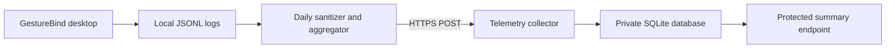

# Daily Usage Telemetry

GestureBind can send one privacy-safe aggregate report per installation every
24 hours. Telemetry is disabled by default and starts only after the user
enables anonymous quality statistics in the application settings.

## Data Flow



The client stores an anonymous random installation ID, file cursors and the
last successful upload time in `~/.dplm/logs/telemetry_state.json`. Failed
uploads retain their cursors and retry while the application is running or on
the next launch. Report IDs are deterministic for the same cursor range, so
collector retries are idempotent.

## Privacy Contract

Uploaded reports contain:

- application version and coarse platform architecture;
- counts by event type, static/dynamic route and model mode;
- confidence histogram and command execution aggregate;
- user feedback counts: correct, incorrect and missed;
- aggregate inference latency and hand-detection rate.

Reports never contain camera frames, landmarks, recordings, raw gesture labels,
command text, filesystem paths, account names or hardware identifiers. Enabling
telemetry starts the cursors at the current end of the local logs, so events
recorded before consent are not uploaded. Disabling telemetry revokes and
rotates the anonymous installation ID.

## Run The Collector

For a local check:

```bash
export TELEMETRY_PROJECT_KEY=beta-ingest-key
export TELEMETRY_ADMIN_TOKEN=replace-with-a-long-random-value
PYTHON=.venv/bin/python make telemetry-collector
```

The local endpoints are:

- `POST http://127.0.0.1:8787/v1/telemetry/daily`;
- `GET http://127.0.0.1:8787/health`;
- `GET http://127.0.0.1:8787/v1/telemetry/summary?days=30`.

Reports are retained for `90` days by default. Override this with
`TELEMETRY_RETENTION_DAYS`; old reports are pruned during ingestion.

Read the private aggregate:

```bash
curl \
  -H "Authorization: Bearer $TELEMETRY_ADMIN_TOKEN" \
  "http://127.0.0.1:8787/v1/telemetry/summary?days=30"
```

The summary directly reports `user_confirmed_precision`,
`incorrect_feedback_rate`, `missed_feedback`, command success, active
installations, inference latency and counts by route/event type.

For remote beta usage, run the collector behind an HTTPS reverse proxy and add
request rate limiting. Do not expose its plain HTTP port directly to the
internet. `TELEMETRY_ADMIN_TOKEN` is server-only. The project key is an ingest
identifier embedded in the desktop app and must not be treated as a secret.

The repository includes a minimal container deployment:

```bash
cp deploy/telemetry/env.example deploy/telemetry/.env
# Replace both values in deploy/telemetry/.env.
docker compose \
  --env-file deploy/telemetry/.env \
  -f docker-compose.telemetry.yml \
  up -d --build
```

The container binds only to `127.0.0.1:8787`; terminate HTTPS in Caddy, Nginx
or the hosting platform in front of it. The SQLite database lives in the named
volume `gesturebind_telemetry`.

## Configure A GitHub macOS Build

Create these GitHub Actions repository variables before building the release:

| Variable | Value |
|---|---|
| `GESTUREBIND_TELEMETRY_ENDPOINT` | `https://your-host/v1/telemetry/daily` |
| `GESTUREBIND_TELEMETRY_PROJECT_KEY` | beta ingest project key |

The macOS packaging job writes these values into an internal release config.
The URL is not shown to end users. It does not enable telemetry by itself; the
user must still opt in from the Privacy section in Settings.

For source runs, use equivalent environment variables:

```bash
export DPLM_TELEMETRY_ENDPOINT=https://your-host/v1/telemetry/daily
export DPLM_TELEMETRY_PROJECT_KEY=beta-ingest-key
```

`DPLM_TELEMETRY_INTERVAL_HOURS` defaults to `24`. Remote HTTP URLs are rejected;
plain HTTP is accepted only for localhost development.
