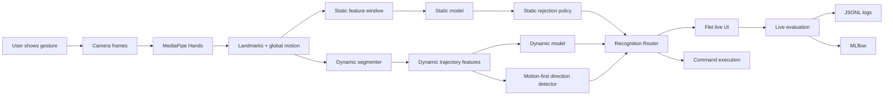
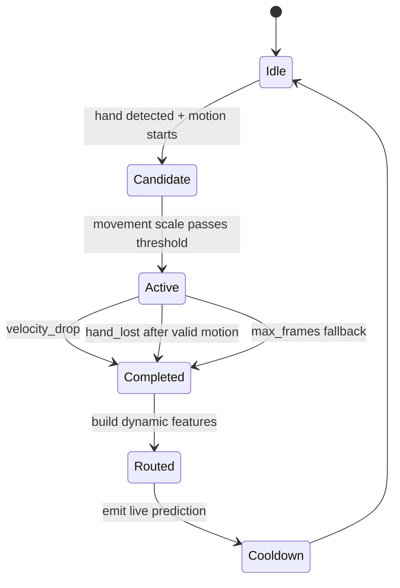
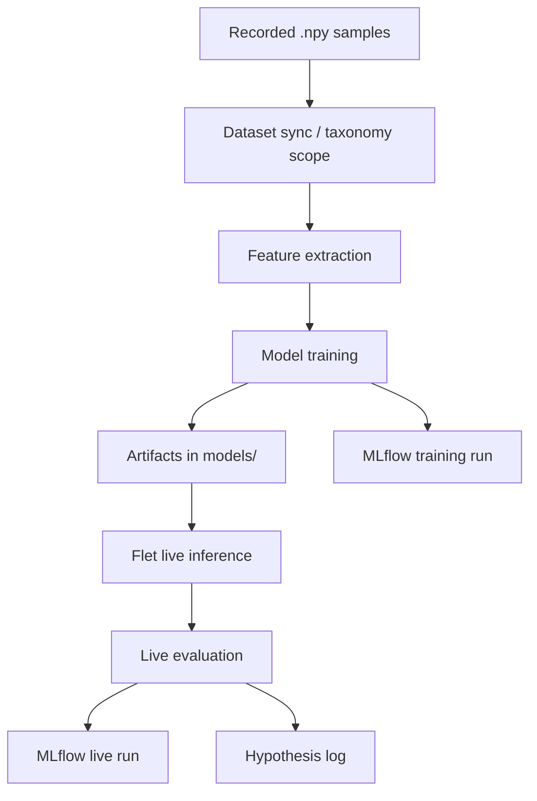

# GestureFlow ML System Design

Last updated: `2026-06-29`

Purpose: единый living-документ по ML-системе GestureFlow для JMLC. Здесь
фиксируется не только текущая архитектура, но и путь разработки: что уже
стабильно, что валидируется, что находится в работе и какие метрики доказывают
прогресс.

## 1. Status Board

| Area | Status | Evidence | Next check |
|---|---|---|---|
| Static gesture recognition | Stable | legacy/static pipeline works through Flet | refresh per-class live metrics |
| Dynamic gesture recording | Stable | developer UI records dynamic samples | keep protocol in `gesture_protocol.md` |
| Dynamic natural swipe segmentation | In Progress | H-036/H-038 natural end, H-053 return guard added | repeat no-command/return-motion validation |
| Auto routing static/dynamic | Validated | H-038: static hijack `0%` on 30 fresh dynamic attempts | add negative/no-gesture live run |
| `swipe_left` dynamic recognition | Stable | H-038: `10/10`, `100%` recall | keep as current baseline |
| `swipe_up/down` dynamic recognition | In Progress | H-053: up can be `10/10`, down drops to `4-5/10` via return-up phase | validate return guard and add sequence verifier |
| Negative examples / rejection layer | Added | H-041 synthetic negatives, H-053 `no_command` live target | run no-command live validation |
| Rejection method benchmark | Added | H-042: offline comparison of 9 reject strategies | compare against live runs |
| Live rejection A/B testing | Added | H-043/H-044: Flet + MLflow track `static_rejection_method`, charts added | run 20-attempt live matrix |
| MLflow experiment tracking | Stable | training and live runs in `GestureFlow` experiment | compare live runs after every test |
| HTML MLOps dashboard | Stable | `docs/mlops_dashboard/index.html` | regenerate before demo |
| AI/multi-agent layer | Planned | router/data/MLOps agent design exists conceptually | implement non-critical assistant workflows |
| Dynamic sequence verifier | Added | H-054: `prototype_distance` and `prototype_dtw` compared, negative FP `0.0000` offline | live A/B against KNN |

Status legend:

| Status | Meaning |
|---|---|
| Stable | Works, has tests or live evidence, can be shown in demo |
| Validated | Solved a specific hypothesis, needs periodic re-check |
| Added | Implemented, but not enough live evidence yet |
| In Progress | Main current improvement target |
| Planned | Designed, not production-critical yet |
| Blocked | Needs user data, environment access, or external decision |

## 2. Product Goal

GestureFlow is a personalized gesture-control system for desktop workflows. A
user records their own gestures with a webcam, trains recognition models, binds
recognized gestures to commands and then uses them in a live interface.

Contest framing:

- not a notebook-only classifier;
- a full ML Engineering system with data collection, preprocessing, model
  training, online inference, live evaluation, MLOps tracking and product UI;
- current ML focus: robust dynamic gesture recognition under small personal
  datasets.

## 3. End-to-End ML Flow

Core design choice: dynamic gestures are treated as temporal events, not as
static poses. A natural swipe should be recognized after movement ends by
`velocity_drop` or `hand_lost`, without requiring a final hold.

## 4. Data Sources

| Source | Path / system | What it contains | Status |
|---|---|---|---|
| Recorded samples | `data/gestures/<label>/sample_*.npy` | raw landmark sequences | Stable |
| Taxonomy | `configs/gesture_taxonomy.json` | static/dynamic/negative label scope | Stable |
| Static model artifacts | `models/knn.pkl`, `classes.json` | static/quasi-static recognizer | Stable |
| Static rejection metadata | `models/gesture_rejection.json` | negative labels, class prototypes, reject thresholds | Added |
| Static rejection verifiers | `models/static_rejection_verifiers.pkl` | one-vs-rest, one-class, isolation, LOF, metric, MLP verifiers | Added |
| Dynamic model artifacts | `models/dynamic_knn.pkl`, `dynamic_classes.json` | dynamic recognizer | Stable |
| Dynamic prototype verifier | `models/dynamic_prototypes.json` | open-set sequence verifier for dynamic gestures | Added |
| Negative synthetic samples | `docs/experiments/negative_sampling_manifest.json` | reproducible generated negative set | Added |
| Rejection benchmark reports | `docs/experiments/rejection_method_benchmark_*.md` | offline comparison of reject methods | Added |
| Live rejection protocol | `docs/experiments/live_rejection_test_protocol.md` | step-by-step live A/B test plan | Added |
| Live eval logs | `~/.dplm/logs/live_evaluation.jsonl` | attempt-level real-camera results | Stable |
| Runtime logs | `~/.dplm/logs/runtime_performance.jsonl` | latency/FPS diagnostics | Stable |
| MLflow backend | `mlflow.db` | training/live experiment history | Stable |
| HTML dashboard | `docs/mlops_dashboard/` | local snapshot for demo | Stable |

## 5. Feature Design

### Static / Quasi-Static

Static gestures are represented by window-level pose statistics. The model
should be conservative: a static gesture is confirmed over multiple frames to
avoid accidental command execution.

Current properties:

- uses MediaPipe hand landmarks;
- confirms via dwell/anti-bounce logic;
- trains only on `static,quasi_static,negative` taxonomy scope;
- uses `expect_dim=42` so static inference is pose-based;
- can reject unsafe predictions via negative class probability, top1/top2
  margin and distance-to-prototype;
- can switch live rejection strategy in Flet:
  `open_set_policy`, `one_vs_rest_logreg`, `negative_classes`,
  `confidence_threshold`, `one_class_svm`, `isolation_forest`,
  `local_outlier_factor`, `metric_nca_centroid`, `mlp_negative_classes`;
- participates in auto routing only when dynamic route is not active.

### Dynamic

Dynamic gestures use trajectory-level features and a motion-first layer.

Key signals:

| Signal | Why it matters |
|---|---|
| `dynamic_axis` | separates horizontal vs vertical motion |
| `dynamic_direction` | maps movement to `left`, `up`, `down` |
| `dynamic_axis_ratio` | detects diagonal contamination |
| `dynamic_straightness` | penalizes curved/noisy motion |
| `dynamic_motion_scale` | normalizes movement magnitude |
| `dynamic_segment_frames` | captures gesture duration |
| `dynamic_end_reason` | shows whether natural swipe ended by movement or hand loss |

Latest evidence:

| Expected | Latest score | Routing risk | Failure mode | Evidence |
|---|---:|---:|---:|---:|
| `swipe_up` | `10/10` in latest baseline run | `0%` in prior route tests | current risk: variant-sensitive false left | live screenshots, H-053 |
| `swipe_down` | `4-5/10` latest runs | `0%` in prior route tests | wrong mostly `swipe_up` after return phase | live screenshots, H-053 |
| `swipe_left` | `10/10` latest runs | `0%` in prior route tests | `0%` in latest positive runs | live screenshots, H-053 |

Interpretation: routing is now good, but dynamic inference still needs two
guards: event policy for return-motion and a model-level verifier so KNN does
not force every ambiguous movement into the nearest known class.

## 6. Online Inference Design

Router policy:

| Case | Decision |
|---|---|
| dynamic segment completed and accepted | route=`dynamic` |
| dynamic and model/motion agree | decision=`motion_and_model_agree` |
| dynamic motion valid but model weak | motion-first fallback can still emit |
| no dynamic event and static label stable | route=`static` |
| negative/rejection condition | reject or mark as negative |

Important invariant: during a dynamic live test, static route is counted as
`wrong`, not ignored. This is how `live_static_hijack_rate` remains honest.

## 7. Training Pipeline

Training artifacts:

| Artifact | Purpose |
|---|---|
| `models/knn.pkl` | current static/quasi-static baseline |
| `models/gesture_rejection.json` | static open-set/rejection metadata |
| `models/dynamic_knn.pkl` | current dynamic baseline |
| `models/dynamic_svm.pkl` | candidate comparison |
| `models/dynamic_extra_trees.pkl` | candidate comparison |
| `models/dynamic_feature_mode.txt` | feature contract |
| `models/dynamic_feature_dim.txt` | inference dimension contract |
| `models/dynamic_classes.json` | class order contract |

Current model choice:

- KNN remains the live baseline because it works best with small personalized
  samples and motion-first routing.
- SVM/ExtraTrees were kept as candidates, but live evidence was worse.
- Next model step should be data/feature improvement before adding LSTM or
  Transformers.

## 8. Evaluation Metrics

Offline metrics:

| Metric | Purpose |
|---|---|
| accuracy | broad sanity check |
| macro F1 | class-balanced quality |
| per-class recall | catches weak classes |
| confusion matrix | finds direction/class mixups |
| threshold report | confidence vs coverage |

Live metrics:

| Metric | Purpose |
|---|---|
| `live_accuracy` | correct / emitted attempts |
| `live_recall` | correct / target attempts |
| `live_static_hijack_rate` | dynamic classified as static |
| `live_static_accept_rate` | accepted static route share |
| `live_static_reject_rate` | rejected/no-route static share |
| `live_static_false_positive_rate` | static false trigger on negative scenario |
| `live_static_rejection_method_*_count` | which static reject strategy was tested |
| `attempt_static_verifier_probability` | one-vs-rest verifier confidence per attempt |
| `attempt_static_verifier_distance` | metric verifier distance per attempt |
| `attempt_static_verifier_threshold` | live verifier rejection threshold |
| `live_wrong_dynamic_direction_rate` | swipe direction confusion |
| `live_negative_false_positive_rate` | false trigger on negative scenario |
| `live_latency_avg_s`, `p50`, `p95` | interaction delay |
| `live_end_reason_*` | natural swipe completion diagnostics |
| `live_decision_*` | router decision diagnostics |

Acceptance targets for contest demo:

| Target | Desired value |
|---|---:|
| static hijack on dynamic tests | `0%` |
| `swipe_left` recall | `>=90%` |
| `swipe_up/down` recall | `>=80%` |
| static false positive rate on negative tests | `<=10%` |
| negative false positive rate | `<=10%` |
| p95 live latency | under interactive threshold, explain if higher |

## 9. MLOps Design

Three complementary observability layers are used or planned:

| Layer | Role | Command |
|---|---|---|
| MLflow | experiment history for training and live tests | `PYTHON=.venv/bin/python make mlflow-ui` |
| HTML dashboard | static snapshot for demo and quick review | `make mlops-dashboard` |
| Grafana + Prometheus | planned always-on runtime/system monitoring | planned |

Boundary:

- MLflow answers: which model/live-run was better, with artifacts and metrics
  tied to an experiment.
- Grafana answers: how the running application behaves over time: FPS, camera
  health, latency, CPU/RAM and false triggers.
- HTML dashboard answers: what to show quickly in a local demo without running
  a service.

MLflow run types:

| Run kind | Name pattern | Logged content |
|---|---|---|
| Training | `<model>-<feature_mode>` | params, model artifacts, rejection metadata, sample count, train accuracy |
| Static verifier training | `static-rejection-verifiers` | trained second-stage reject methods and method readiness |
| Live evaluation | `live-<expected>-<mode>-<profile>-<static_rejection_method>` | live metrics, route counts, raw attempts artifact |
| External negative datasets | `external-negative-<variant>-<scope>` | public-dataset negative benchmark, artifacts, best reject method |

Live MLflow runs also store an artifact bundle under `live_evaluation/`:

- `index.html` - readable run report;
- `charts/*.svg` - quality, route, end-reason, runtime and attempt timeline
  charts;
- `charts/static_rejection.svg` - selected reject method, decision source and
  rejection reasons;
- `charts/static_verifier_signals.svg` - verifier probability/confidence/distance
  signals;
- `attempts.csv` - attempt-level data;
- `metrics.csv` - flat metric export;
- `runtime_performance.json` - runtime windows matched to the live run.

Every meaningful live test should be followed by:

1. Check MLflow run exists.
2. Compare `live_accuracy`, `live_static_hijack_rate`,
   `live_wrong_dynamic_direction_rate`, `live_static_false_positive_rate`,
   `live_static_rejection_method_*`.
3. Write conclusion to `docs/experiments/ml_pipeline_log.md`.
4. Update this file's Status Board if a component changed status.

Rejection method benchmark:

| Scope | Current best offline method | Evidence |
|---|---|---|
| static | `one_vs_rest_logreg` | `overall_success=0.9774`, negative FP `0.0100` |
| dynamic | `open_set_policy` | `overall_success=1.0000`, negative FP `0.0000` |

## 10. AI / Multi-Agent Layer

The core recognizer is deterministic ML/CV, not LLM-driven. AI agents are useful
around the ML lifecycle, where they improve research velocity and traceability.

| Agent | Status | Responsibility |
|---|---|---|
| Router Agent | Planned | explain static/dynamic route decisions and reject unsafe output |
| Data Quality Agent | Planned | inspect new samples for scale, position, axis and speed drift |
| Experiment Agent | Planned | summarize MLflow runs and propose next hypothesis |
| Product Feedback Agent | Planned | turn user live-test notes into tracked issues |
| Documentation Agent | Added manually | keep `ml_pipeline_log.md` and this design doc current |

Rule: LLM/agent output must not directly execute OS commands. It can recommend,
summarize and annotate; execution stays behind deterministic policies.

## 11. Development Path

| Phase | Status | Result |
|---|---|---|
| Static baseline | Stable | simple gestures recognized from webcam |
| Dynamic recording | Stable | UI can record dynamic gesture samples |
| Model comparison | Validated | KNN/SVM/ExtraTrees separated; KNN kept for live |
| Live evaluation mode | Stable | real attempts counted as correct/wrong/missed |
| Natural swipe | Validated | no final pose required |
| Negative examples | Added | synthetic negatives generated automatically |
| External negative datasets | Added | IPN/HaGRID experiment harness ready; data files pending |
| IPN Hand dynamic research | Added | two-stage detector/classifier ideas accepted for dynamic roadmap |
| Custom dynamic gestures | Added | swipes treated as first test classes, not final limitation |
| IPN converter | Added | mapping/report/MLflow ready; raw IPN files pending |
| Static open-set rejection | Added | `gesture_rejection.json` + runtime reject policy |
| Rejection benchmark | Added | static/dynamic reports compare 9 methods |
| MLflow integration | Stable | training and live runs tracked |
| Auto routing | Validated | fresh static hijack `0%` |
| Vertical direction quality | In Progress | `swipe_down` still confused with return-up motion |
| Dynamic sequence verifier | Added | `prototype_distance` selected as cheaper offline-tied best |
| User/market feedback | Planned | needed for product thinking criterion |

## 12. Current Risks

| Risk | Impact | Mitigation |
|---|---|---|
| Small personal dataset | model overfits recording conditions | augment position/scale/speed, collect controlled live tests |
| Vertical direction confusion | `swipe_up/down` unstable | return guard, then sequence verifier with reject threshold |
| No static/negative live validation yet | false triggers may be hidden | run 20 no-gesture/background attempts and check static rejection metrics |
| Public dataset domain shift | external data may hurt personalized gestures | use as negative evidence only, require live A/B before promotion |
| Dirty local workspace | accidental commits/noisy demo | commit scoped files only, keep branch clean before submission |
| MLflow local-only | harder to review remotely | export screenshots/summary and keep `mlflow.db` ignored |

## 13. Next Engineering Steps

### Now

| Task | Status | Owner |
|---|---|---|
| Test real static gestures after rejection policy | Next | user + ML pipeline |
| Run `no_command` live evaluation and log to MLflow | Next | user + ML pipeline |
| Download/place a small IPN subset under `data/raw/ipn_hand` | Next | data pipeline |
| Add IPN converter and dynamic intent detector experiment | Next | ML pipeline |
| Add generic sequence/prototype dynamic classifier | Done | H-054 |
| Analyze `swipe_up/down` correct vs wrong trajectory features | In Progress | ML pipeline |
| Regenerate HTML MLOps dashboard after fresh tests | Next | MLOps |

### Next

| Task | Status | Owner |
|---|---|---|
| Add direction-gate report for live attempts | Planned | ML pipeline |
| Add UI link/instruction for MLflow and dashboard | Planned | product/dev |
| Add model card for current dynamic KNN | Planned | ML pipeline |

### Later

| Task | Status | Owner |
|---|---|---|
| Try sequence model only after data quality stabilizes | Backlog | ML research |
| Add user study script and feedback table | Backlog | product |
| Package reproducible demo mode | Backlog | engineering |

## 14. How To Update This File

Use this doc as the high-level map and keep raw details in experiment files.

When something changes:

1. Update `Last updated`.
2. Update `Status Board`.
3. Add evidence from MLflow or tests.
4. If it is a hypothesis result, add full details to
   `docs/experiments/ml_pipeline_log.md`.
5. Keep statuses conservative: do not mark `Stable` without either tests or
   live evidence.

Change log:

| Date | Change | Evidence |
|---|---|---|
| `2026-06-27` | Created ML system design doc | H-038, MLflow live runs |
| `2026-06-28` | Added external negative dataset experiment layer | H-045, MLflow external runs |
| `2026-06-28` | Added IPN Hand research analysis | H-047 |
| `2026-06-28` | Accepted arbitrary custom dynamic gesture architecture | H-048 |
| `2026-06-28` | Added IPN converter and conversion report | H-049 |
| `2026-06-29` | Added no-command/return-motion live policy and planned dynamic verifier | H-053 |
| `2026-06-29` | Added dynamic prototype verifier and offline comparison | H-054 |
