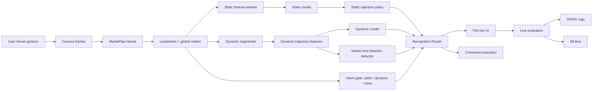
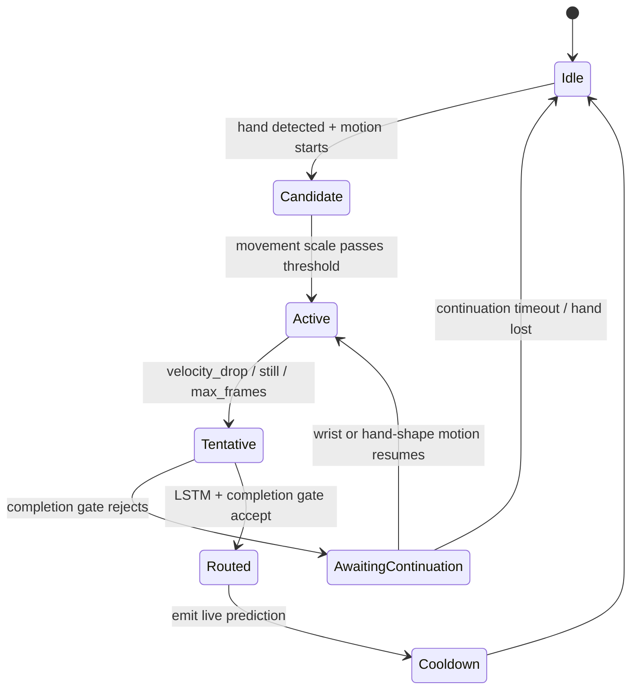
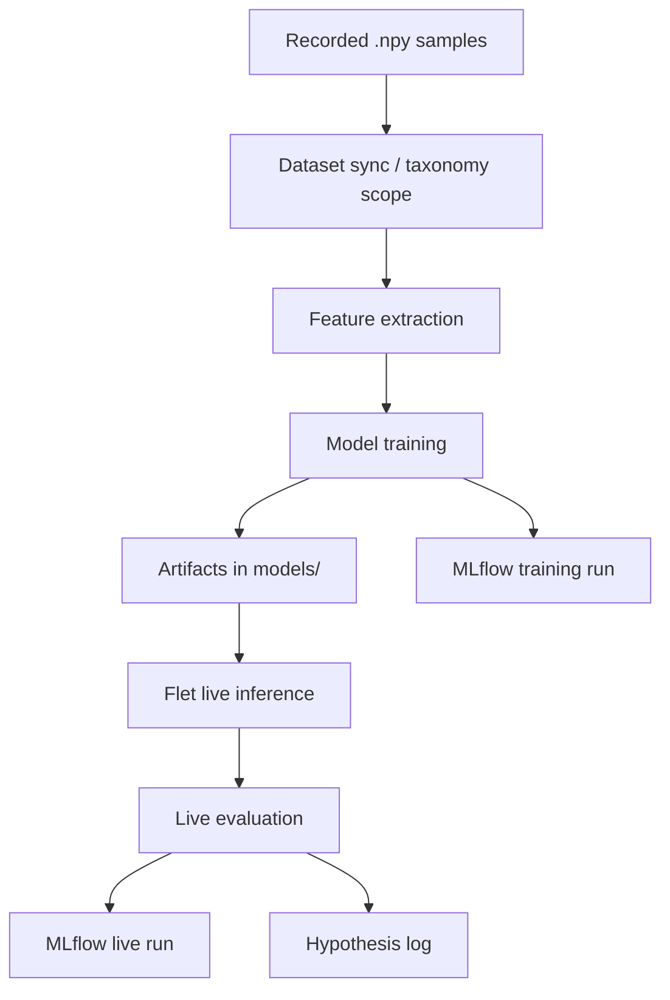

# GestureBind ML System Design

Last updated: `2026-07-10`

Purpose: единый living-документ по ML-системе GestureBind для JMLC. Здесь
фиксируется не только текущая архитектура, но и путь разработки: что уже
стабильно, что валидируется, что находится в работе и какие метрики доказывают
прогресс.

## 1. Status Board

| Area | Status | Evidence | Next check |
|---|---|---|---|
| Static gesture recognition | Stable | H-105/H-116/H-117: grouped CV `0.7767`; live `20/20`; background FP `0/30` | freeze for v0.8.0 |
| Dynamic gesture recording | Stable | H-106/H-117: duplicate gate plus completed positive/safety matrices | freeze for v0.8.0 |
| Dynamic completion safety | Validated live-safety | H-115-H-117: positive dynamic `38/40`, partial FP `1/20`, background FP `0/30` | monitor new user classes |
| Auto routing static/dynamic | Validated live | H-114-H-117: thresholds `0.80/0.90`; positive `58/60`; safety false commands `1/50` | freeze for v0.8.0 |
| `SwipeLeft` dynamic recognition | Stable | H-116: post-gate `20/20`, `100%` recall | keep as current baseline |
| `swipe_up/down` dynamic recognition | In Progress | H-053: up can be `10/10`, down drops to `4-5/10` via return-up phase | validate return guard and add sequence verifier |
| Negative examples / rejection layer | Validated live | H-117: background/no-command false commands `0/30` | monitor after new classes |
| Rejection method benchmark | Added | H-042: offline comparison of 9 reject strategies | compare against live runs |
| Live rejection A/B testing | Added | H-043/H-044: Flet + MLflow track `static_rejection_method`, charts added | run 20-attempt live matrix |
| MLflow experiment tracking | Stable | H-108 logs dataset/model SHA-256, git state, source groups and grouped validation | use clean committed runs for final charts |
| Release usage telemetry | Added | H-118: daily sanitized aggregates, consent, retry, feedback and collector | deploy HTTPS collector for beta |
| HTML MLOps dashboard | Stable | H-096: `docs/mlops_dashboard/index.html` includes MLflow showcase charts for training, live A/B, safety and timeline | regenerate before demo |
| Release home experience | Validated | H-110: camera-first UI, friendly runtime state, one primary action; `205` Flet tests and desktop visual check | run final live demo matrix |
| MVP repository contract | Release ready | H-111-H-117: Flet-only runtime, allowlisted models, positive and safety matrices passed | verify final commit archive |
| AI/multi-agent layer | Planned | router/data/MLOps agent design exists conceptually | implement non-critical assistant workflows |
| Dynamic sequence verifier | Added | H-054: `prototype_distance` and `prototype_dtw` compared, negative FP `0.0000` offline | live A/B against KNN |
| Dynamic neural sequence model | Added | H-068: `sequence_mlp` trained on `dynamic_sequence`, MLflow run logged | keep as baseline against landmark-LSTM |
| Dynamic sequence ensemble | Added | H-086: `sequence_ensemble` trained, prototype report positive recall `0.9565`, negative FP `0.0074` | live A/B on `upandleft` and negative motions |
| Dynamic GISLR landmark LSTM | Validated live | H-109/H-116/H-117: grouped validation `0.8571`; live `38/40`; partial/background FP `5%/0%` | freeze for v0.8.0 |
| Static landmark CNN benchmark | Parked | H-092: `static_landmark_cnn` CV macro F1 `0.4599`, behind ExtraTrees; H-094 keeps roadmap vector-first | keep historical artifact only |
| Static CV benchmark report | Added | H-092: `docs/experiments/static_cv_benchmark.md/json`, 5-fold comparison across feature modes and models | rerun after new recording sessions |
| Static rejection-focused benchmark | Added | H-093: craft/image ExtraTrees reject negative motion with FP `0.0000` | live 20-attempt no-command matrix |
| Intent gate `static/dynamic/none` | Added | H-070: MLP gate offline accuracy `0.9672`, macro F1 `0.9480` | live matrix: static, dynamic, random/no-command |
| MediaPipe quality A/B | Added | H-085: timestamp, thresholds, smoothing, hand-lost grace logged to MLflow | compare profiles on live 20-attempt matrix |

Status legend:

| Status | Meaning |
|---|---|
| Stable | Works, has tests or live evidence, can be shown in demo |
| Validated | Solved a specific hypothesis, needs periodic re-check |
| Added | Implemented, but not enough live evidence yet |
| In Progress | Main current improvement target |
| Planned | Designed, not production-critical yet |
| Blocked | Needs user data, environment access, or external decision |

## 2. Product Goal

GestureBind is a personalized gesture-control system for desktop workflows. A
user records their own gestures with a webcam, trains recognition models, binds
recognized gestures to commands and then uses them in a live interface.

Contest framing:

- not a notebook-only classifier;
- a full ML Engineering system with data collection, preprocessing, model
  training, online inference, live evaluation, MLOps tracking and product UI;
- current ML focus: robust dynamic gesture recognition under small personal
  datasets.

## 3. End-to-End ML Flow

Core design choice: dynamic gestures are treated as temporal events, not as
static poses. A natural swipe should be recognized after movement ends by
`velocity_drop` or `hand_lost`, without requiring a final hold.

## 4. Data Sources

| Source | Path / system | What it contains | Status |
|---|---|---|---|
| Recorded samples | `data/gestures/<label>/sample_*.npy` | raw landmark sequences | Stable |
| Taxonomy | `configs/gesture_taxonomy.json` | static/dynamic/negative label scope | Stable |
| Static model artifacts | `models/knn.pkl`, `classes.json` | static/quasi-static recognizer | Stable |
| Static CNN benchmark artifacts | `models/experiments/static_landmark_cnn/*` | historical TensorFlow CNN over `30 x 21 x 3`; not production candidate | Parked |
| Static image ExtraTrees variant | `models/experiments/static_landmark_image_extra_trees/*` | ExtraTrees over `static_landmark_image`, selectable from UI | Added |
| Static CV benchmark reports | `docs/experiments/static_cv_benchmark.md/json` | 5-fold comparison of ExtraTrees, stacking, CNN and static feature modes | Added |
| Static rejection-focused reports | `docs/experiments/static_rejection_benchmark_*_extratrees.md/json` | runtime-style positive recall and negative false positive benchmark | Added |
| Static rejection metadata | `models/gesture_rejection.json` | negative labels, class prototypes, reject thresholds | Added |
| Static rejection verifiers | `models/static_rejection_verifiers.pkl` | one-vs-rest, one-class, isolation, LOF, metric, MLP verifiers | Added |
| Legacy dynamic model artifacts | `models/dynamic_knn.pkl`, `dynamic_classes.json` | old dynamic recognizer contract | Stable |
| Dynamic sequence MLP artifacts | `models/dynamic_sequence_mlp.*` | neural baseline over 36-frame dynamic sequences | Added |
| Dynamic landmark LSTM artifacts | `models/dynamic_landmark_lstm_backbone.*` | production dynamic profile over `dynamic_landmark_image`, `72 x 22 x 3` | Added |
| Dynamic sequence ensemble artifacts | `models/dynamic_sequence_ensemble.*` | soft-voting MultiRocket/SProcket/Shapelet/PhaseHMM dynamic recognizer | Added |
| Dynamic prototype verifier | `models/dynamic_prototypes.json` | open-set sequence verifier for dynamic gestures | Added |
| Dynamic landmark LSTM verifier | `models/dynamic_landmark_lstm_backbone_prototypes.json` | open-set verifier for production landmark-LSTM profile | Added |
| Dynamic sequence MLP verifier | `models/dynamic_sequence_mlp_prototypes.json` | open-set verifier for the sequence MLP profile | Added |
| Intent gate model | `models/intent_gate_mlp.pkl` | first-stage `static/dynamic/none` ML router | Added |
| Negative synthetic samples | `docs/experiments/negative_sampling_manifest.json` | reproducible generated negative set | Added |
| Rejection benchmark reports | `docs/experiments/rejection_method_benchmark_*.md` | offline comparison of reject methods | Added |
| Live rejection protocol | `docs/experiments/live_rejection_test_protocol.md` | step-by-step live A/B test plan | Added |
| Live eval logs | `~/.dplm/logs/live_evaluation.jsonl` | attempt-level real-camera results | Stable |
| Runtime logs | `~/.dplm/logs/runtime_performance.jsonl` | latency/FPS diagnostics | Stable |
| MediaPipe A/B protocol | `docs/experiments/mediapipe_ab_experiment.md` | landmark quality and threshold profile testing | Added |
| MLflow backend | `mlflow.db` | training/live experiment history | Stable |
| HTML dashboard | `docs/mlops_dashboard/` | local snapshot for demo | Stable |

## 5. Feature Design

### Static / Quasi-Static

Static gestures are represented by window-level pose geometry. The production
path uses GISLR-style handcrafted hand features because the user dataset is
small and personalized. The model should be conservative: a static gesture is
confirmed over multiple frames to avoid accidental command execution.

Current properties:

- uses MediaPipe hand landmarks;
- records `21 * xyz = 63` features per hand for new static samples;
- trains production static model with `static_craft_full_stats`: raw
  `mean/std/min/max`, all `210` pairwise hand distances, `15` finger angles
  and time aggregates;
- production classifier is `ExtraTreesClassifier` with balanced classes and
  optional Optuna tuning;
- parks `static_landmark_cnn` as historical benchmark evidence after H-092/H-094;
- keeps `static_landmark_image_extra_trees` as a UI-selectable A/B variant
  after H-092/H-093;
- validates static model changes through H-092-style stratified
  cross-validation instead of relying on train accuracy;
- confirms via dwell/anti-bounce logic;
- trains only on `static,quasi_static,negative` taxonomy scope;
- uses `expect_dim=63`; legacy `42`-dim `xy` samples are converted with
  `z = 0`;
- can reject unsafe predictions via negative class probability, top1/top2
  margin and distance-to-prototype;
- can switch live rejection strategy in Flet:
  `open_set_policy`, `one_vs_rest_logreg`, `negative_classes`,
  `confidence_threshold`, `one_class_svm`, `isolation_forest`,
  `local_outlier_factor`, `metric_nca_centroid`, `mlp_negative_classes`;
- participates in auto routing only when dynamic route is not active.
- can switch production vs vector-feature benchmark variants from the Flet
  model-variant dropdown.

### MediaPipe Quality Layer

MediaPipe is treated as a measurable CV feature extractor, not as an invisible
black box. The live pipeline now logs:

- profile and thresholds: `baseline_06`, `recall_05`, `strict_tracking`,
  `redetect_presence`;
- real camera timestamp usage;
- optional EMA landmark smoothing;
- `z/world landmarks` availability and depth ranges;
- hand bbox size, wrist step, hand detected rate and hand-lost streak.

For newly recorded samples, image-space `z` is now part of the static and
dynamic feature contract. World landmarks remain diagnostic/future work; they
should become a separate experiment only after enough new samples are recorded.

### Intent Gate

The router now has a first-stage ML gate before choosing the final route. The
goal is not to classify the exact gesture; it decides only whether the current
window looks like:

- `static`: stable pose, let the static recognizer compete;
- `dynamic`: intentional movement, wait for/accept the dynamic recognizer;
- `none`: random motion, return movement, partial gesture or no useful command.

Implementation:

- artifact: `models/intent_gate_mlp.pkl`;
- training script: `scripts/train_intent_gate.py`;
- features: 25 compact sequence statistics over 44-dim landmark/motion frames;
- labels: taxonomy-derived `static`, `dynamic`, `negative -> none`;
- external negatives: IPN-derived `.npy` sequences under `data/external`;
- MLflow run kind: `intent_gate_training`;
- logged artifacts: model, metadata, markdown/json report, SVG confusion matrix.

Current offline result:

| Metric | Value |
|---|---:|
| accuracy | `0.9672` |
| macro F1 | `0.9480` |
| dynamic precision | `0.9444` |
| dynamic recall | `0.9444` |
| dynamic false positive rate | `0.0061` |
| none recall | `0.9778` |

Runtime policy:

- if gate says `dynamic` confidently, static labels are held until the dynamic
  segment completes;
- if gate says `static` confidently, static route can win;
- if gate says `none` confidently, router emits no command;
- if the gate is missing or below threshold, the previous deterministic router
  policy is used as fallback.

### Dynamic

Dynamic gestures use trajectory-level features, a motion-first layer and a
GISLR-style temporal landmark representation for the production neural model.

Current production dynamic profile:

- `dynamic_landmark_lstm_backbone`;
- feature mode: `dynamic_landmark_image`;
- input contract: `72 x 22 x 3` = `72` frames, `21` hand landmarks + global
  wrist point, `x/y/z` channels;
- per-frame backbone MLP -> LSTM -> `final/mean/max` temporal pooling head;
- artifacts use the `models/dynamic_landmark_lstm_backbone.*` prefix;
- model-specific rejection metadata contains automatically trained completion
  profiles for every positive user class;
- `sequence_mlp`, Rocket/MultiRocket/SProcket/Shapelet/PhaseHMM and
  `sequence_ensemble` remain selectable A/B baselines.

Key signals:

| Signal | Why it matters |
|---|---|
| `dynamic_axis` | separates horizontal vs vertical motion |
| `dynamic_direction` | maps movement to `left`, `up`, `down` |
| `dynamic_axis_ratio` | detects diagonal contamination |
| `dynamic_straightness` | penalizes curved/noisy motion |
| `dynamic_motion_scale` | normalizes movement magnitude |
| `dynamic_segment_frames` | captures gesture duration |
| `dynamic_end_reason` | shows whether natural swipe ended by movement or hand loss |
| raw relative displacement/path/excursion | verifies completion before amplitude normalization |
| signed axis paths and shape change | separates full target motion from own and cross-class prefixes |

Completion verification is class-conditional but label-agnostic: training uses
the actual classes in the current dataset, not hard-coded swipe aliases. Full
target recordings are positives; own prefixes, prefixes/full samples of other
positive classes and available negative classes are hard negatives. Source
groups keep descendants of one recording in the same fold.

H-115 replay evidence:

| Check | Result |
|---|---:|
| Full candidate recordings accepted | `60/60` |
| Prefixes accepted by LSTM alone | `214/240` |
| Prefixes accepted after completion gate | `6/240` |
| Full production state-machine replay | `59/60` |
| Wrong class in state-machine replay | `0/60` |
| Prefix command in state-machine replay | `5/240 = 0.0208` |

This is a regression replay over source recordings, not an independent webcam
test. H-116 supplies the fresh positive webcam matrix; the remaining release
evidence is the partial/look-alike and no-command safety matrix.

Latest evidence:

| Expected | Latest score | Routing risk | Failure mode | Evidence |
|---|---:|---:|---:|---:|
| `SwipeLeft` | `20/20` | `0%` | no miss in post-gate run | H-116 |
| `diagonal` | `9/10` | `0%` | one miss; execution is more complex | H-116 |
| `zoom` | `9/10` | `0%` | one miss; in-place shape motion is harder to perform | H-116 |

Interpretation: routing, prototype rejection and completion verification now
form separate guards. Remaining release uncertainty is live behavior on
unfinished/background motions, not whether the offline LSTM can classify its
recorded full sequences.

## 6. Online Inference Design

Router policy:

| Case | Decision |
|---|---|
| dynamic segment completed and accepted | route=`dynamic` |
| LSTM candidate fails completion profile | no command; wait for continuation |
| continuation resumes before timeout | append to the same raw gesture segment |
| continuation does not resume | clear raw intent without a command |
| dynamic and model/motion agree | decision=`motion_and_model_agree` |
| dynamic motion valid but model weak | motion-first fallback can still emit |
| no dynamic event and static label stable | route=`static` |
| negative/rejection condition | reject or mark as negative |

Important invariant: during a dynamic live test, static route is counted as
`wrong`, not ignored. This is how `live_static_hijack_rate` remains honest.

## 7. Training Pipeline

Training artifacts:

| Artifact | Purpose |
|---|---|
| `models/knn.pkl` | current static/quasi-static baseline |
| `models/gesture_rejection.json` | static open-set/rejection metadata |
| `models/dynamic_landmark_lstm_backbone.pkl` | current production dynamic landmark-LSTM model |
| `models/dynamic_landmark_lstm_backbone_feature_mode.txt` | `dynamic_landmark_image` feature contract |
| `models/dynamic_landmark_lstm_backbone_feature_dim.txt` | dynamic landmark-image inference dimension contract |
| `models/dynamic_landmark_lstm_backbone_rejection.json` | confidence, open-set and adaptive completion profiles |
| `models/dynamic_knn.pkl` | legacy dynamic baseline |
| `models/dynamic_svm.pkl` | candidate comparison |
| `models/dynamic_extra_trees.pkl` | candidate comparison |
| `models/dynamic_sequence_mlp.pkl` | previous production neural baseline |
| `models/dynamic_classes.json` | legacy class order contract |

Current model choice:

- Dynamic production profile is `dynamic_landmark_lstm_backbone` after H-095.
- It keeps the lightweight runtime contract but uses the GISLR-like
  `time x points x xyz` representation instead of a single flattened
  36-frame MLP input.
- `sequence_mlp` remains available as the previous neural baseline for A/B.
- Next model step is not another architecture change; it is recording fresh
  dynamic classes, training this profile and comparing live/MLflow metrics.

## 8. Evaluation Metrics

Offline metrics:

| Metric | Purpose |
|---|---|
| accuracy | broad sanity check |
| macro F1 | class-balanced quality |
| per-class recall | catches weak classes |
| confusion matrix | finds direction/class mixups |
| threshold report | confidence vs coverage |

Live metrics:

| Metric | Purpose |
|---|---|
| `live_accuracy` | correct / emitted attempts |
| `live_recall` | correct / target attempts |
| `live_static_hijack_rate` | dynamic classified as static |
| `live_static_accept_rate` | accepted static route share |
| `live_static_reject_rate` | rejected/no-route static share |
| `live_static_false_positive_rate` | static false trigger on negative scenario |
| `live_static_rejection_method_*_count` | which static reject strategy was tested |
| `attempt_static_verifier_probability` | one-vs-rest verifier confidence per attempt |
| `attempt_static_verifier_distance` | metric verifier distance per attempt |
| `attempt_static_verifier_threshold` | live verifier rejection threshold |
| `live_wrong_dynamic_direction_rate` | swipe direction confusion |
| `live_negative_false_positive_rate` | false trigger on negative scenario |
| `live_latency_avg_s`, `p50`, `p95` | interaction delay |
| `live_end_reason_*` | natural swipe completion diagnostics |
| `live_decision_*` | router decision diagnostics |
| `live_completion_rejected_count/rate` | unfinished candidate suppression |

Acceptance targets for contest demo:

| Target | Desired value |
|---|---:|
| static hijack on dynamic tests | `0%` |
| `swipe_left` recall | `>=90%` |
| `swipe_up/down` recall | `>=80%` |
| static false positive rate on negative tests | `<=10%` |
| negative false positive rate | `<=10%` |
| p95 live latency | under interactive threshold, explain if higher |

## 9. MLOps Design

Three complementary observability layers are used or planned:

| Layer | Role | Command |
|---|---|---|
| MLflow | experiment history for training and live tests | `PYTHON=.venv/bin/python make mlflow-ui` |
| HTML dashboard | static snapshot for demo and quick review | `make mlops-dashboard` |
| Grafana + Prometheus | planned always-on runtime/system monitoring | planned |

Boundary:

- MLflow answers: which model/live-run was better, with artifacts and metrics
  tied to an experiment.
- Grafana answers: how the running application behaves over time: FPS, camera
  health, latency, CPU/RAM and false triggers.
- HTML dashboard answers: what to show quickly in a local demo without running
  a service.

MLflow run types:

| Run kind | Name pattern | Logged content |
|---|---|---|
| Training | `<model>-<feature_mode>` | params, model artifacts, rejection metadata, sample count, train accuracy |
| Static verifier training | `static-rejection-verifiers` | trained second-stage reject methods and method readiness |
| Live evaluation | `live-<expected>-<mode>-<profile>-<static_rejection_method>` | live metrics, route counts, raw attempts artifact |
| External negative datasets | `external-negative-<variant>-<scope>` | public-dataset negative benchmark, artifacts, best reject method |
| Completion benchmark | `dynamic-completion-release-benchmark` | full/prefix candidate metrics and production state-machine replay |

Live MLflow runs also store an artifact bundle under `live_evaluation/`:

- `index.html` - readable run report;
- `charts/*.svg` - quality, route, end-reason, runtime and attempt timeline
  charts;
- `charts/static_rejection.svg` - selected reject method, decision source and
  rejection reasons;
- `charts/static_verifier_signals.svg` - verifier probability/confidence/distance
  signals;
- `attempts.csv` - attempt-level data;
- `metrics.csv` - flat metric export;
- `runtime_performance.json` - runtime windows matched to the live run.

Every meaningful live test should be followed by:

1. Check MLflow run exists.
2. Compare `live_accuracy`, `live_static_hijack_rate`,
   `live_wrong_dynamic_direction_rate`, `live_static_false_positive_rate`,
   `live_static_rejection_method_*`.
3. Write conclusion to `docs/experiments/ml_pipeline_log.md`.
4. Update this file's Status Board if a component changed status.

Rejection method benchmark:

| Scope | Current best offline method | Evidence |
|---|---|---|
| static | `one_vs_rest_logreg` | `overall_success=0.9774`, negative FP `0.0100` |
| dynamic | `open_set_policy` | `overall_success=1.0000`, negative FP `0.0000` |

## 10. AI / Multi-Agent Layer

The core recognizer is deterministic ML/CV, not LLM-driven. AI agents are useful
around the ML lifecycle, where they improve research velocity and traceability.

| Agent | Status | Responsibility |
|---|---|---|
| Router Agent | Planned | explain static/dynamic route decisions and reject unsafe output |
| Data Quality Agent | Planned | inspect new samples for scale, position, axis and speed drift |
| Experiment Agent | Planned | summarize MLflow runs and propose next hypothesis |
| Product Feedback Agent | Planned | turn user live-test notes into tracked issues |
| Documentation Agent | Added manually | keep `ml_pipeline_log.md` and this design doc current |

Rule: LLM/agent output must not directly execute OS commands. It can recommend,
summarize and annotate; execution stays behind deterministic policies.

## 11. Development Path

| Phase | Status | Result |
|---|---|---|
| Static baseline | Stable | simple gestures recognized from webcam |
| Dynamic recording | Stable | UI can record dynamic gesture samples |
| Model comparison | Validated | KNN/SVM/ExtraTrees separated; KNN kept for live |
| Live evaluation mode | Stable | real attempts counted as correct/wrong/missed |
| Natural swipe | Validated | no final pose required |
| Negative examples | Added | synthetic negatives generated automatically |
| External negative datasets | Added | IPN/HaGRID experiment harness ready; data files pending |
| IPN Hand dynamic research | Added | two-stage detector/classifier ideas accepted for dynamic roadmap |
| Custom dynamic gestures | Added | swipes treated as first test classes, not final limitation |
| IPN converter | Added | mapping/report/MLflow ready; raw IPN files pending |
| Static open-set rejection | Added | `gesture_rejection.json` + runtime reject policy |
| Rejection benchmark | Added | static/dynamic reports compare 9 methods |
| MLflow integration | Stable | training and live runs tracked |
| Auto routing | Validated | fresh static hijack `0%` |
| Vertical direction quality | In Progress | `swipe_down` still confused with return-up motion |
| Dynamic sequence verifier | Added | `prototype_distance` selected as cheaper offline-tied best |
| Dynamic neural sequence baseline | Added | `sequence_mlp` trained/logged as previous neural baseline |
| Dynamic landmark LSTM production profile | Added | H-095: GISLR-style `dynamic_landmark_image` + LSTM backbone |
| Adaptive dynamic completion gate | Validated live-safety | H-115-H-117: replay prefix FP `5/240`, live partial FP `1/20`, background FP `0/30` |
| Intent gate `static/dynamic/none` | Added | first-stage MLP router trained/logged with external negatives |
| User/market feedback | Planned | needed for product thinking criterion |

## 12. Current Risks

| Risk | Impact | Mitigation |
|---|---|---|
| Small personal dataset | model overfits recording conditions | augment position/scale/speed, collect controlled live tests |
| Vertical direction confusion | `swipe_up/down` unstable | return guard, then sequence verifier with reject threshold |
| Personalized safety evidence | may not generalize to unseen users/environments | present as controlled protocol and collect post-release feedback |
| Completion replay uses source recordings | optimistic by itself | supplement with H-116/H-117 controlled webcam evidence |
| Public dataset domain shift | external data may hurt personalized gestures | use as negative evidence only, require live A/B before promotion |
| Dirty local workspace | accidental commits/noisy demo | commit scoped files only, keep branch clean before submission |
| MLflow local-only | harder to review remotely | export screenshots/summary and keep `mlflow.db` ignored |
| Remote usage evidence | endpoint must be operated securely | H-118 opt-in aggregate reports via HTTPS; keep admin token server-only |
| Validation leakage from augmentations | inflated offline score | H-105 source-grouped folds and train-only normalization |
| Interrupted model publication | model/sidecar mismatch | H-107 rollback transaction with model-last activation |

## 13. Next Engineering Steps

### Now

| Task | Status | Owner |
|---|---|---|
| Test real static gestures after rejection policy | Done: `20/20` | H-116 |
| Run `no_command` live evaluation and log to MLflow | Done: `0/30` FP | H-117 |
| Live-test intent gate against static/dynamic/none scenarios | Next | user + ML pipeline |
| Record/train 5 dynamic classes with `dynamic_landmark_lstm_backbone` | Next | user + ML pipeline |
| Download/place a small IPN subset under `data/raw/ipn_hand` | Next | data pipeline |
| Add IPN converter and dynamic intent detector experiment | Next | ML pipeline |
| Add generic sequence/prototype dynamic classifier | Done | H-054 |
| Analyze `swipe_up/down` correct vs wrong trajectory features | In Progress | ML pipeline |
| Regenerate HTML MLOps dashboard after fresh tests | Next | MLOps |
| Run final positive live matrix on current classes | Done: `58/60` | H-116 |
| Run partial/look-alike dynamic completion matrix | Done: `1/20` FP | H-117 |

### Next

| Task | Status | Owner |
|---|---|---|
| Add direction-gate report for live attempts | Planned | ML pipeline |
| Live A/B `dynamic_landmark_lstm_backbone` vs `sequence_mlp` | Next | ML research |
| Add UI link/instruction for MLflow and dashboard | Planned | product/dev |
| Add model card for current landmark-LSTM dynamic profile | Planned | ML pipeline |

### Later

| Task | Status | Owner |
|---|---|---|
| Live A/B `sequence_ensemble` vs landmark-LSTM | Backlog | ML research |
| Add user study script and feedback table | Backlog | product |
| Package reproducible demo mode | Backlog | engineering |

## 14. How To Update This File

Use this doc as the high-level map and keep raw details in experiment files.

When something changes:

1. Update `Last updated`.
2. Update `Status Board`.
3. Add evidence from MLflow or tests.
4. If it is a hypothesis result, add full details to
   `docs/experiments/ml_pipeline_log.md`.
5. Keep statuses conservative: do not mark `Stable` without either tests or
   live evidence.

Change log:

| Date | Change | Evidence |
|---|---|---|
| `2026-06-27` | Created ML system design doc | H-038, MLflow live runs |
| `2026-06-28` | Added external negative dataset experiment layer | H-045, MLflow external runs |
| `2026-06-28` | Added IPN Hand research analysis | H-047 |
| `2026-06-28` | Accepted arbitrary custom dynamic gesture architecture | H-048 |
| `2026-06-28` | Added IPN converter and conversion report | H-049 |
| `2026-06-29` | Added no-command/return-motion live policy and planned dynamic verifier | H-053 |
| `2026-06-29` | Added dynamic prototype verifier and offline comparison | H-054 |
| `2026-06-29` | Added `sequence_mlp` neural dynamic baseline | H-068 |
| `2026-07-02` | Added `sequence_ensemble` dynamic model and lowercase-safe prototype evaluation | H-086 |
| `2026-07-05` | Added GISLR-style dynamic landmark LSTM production profile | H-095 |
| `2026-07-10` | Added grouped validation and train-only recurrent normalization | H-105 |
| `2026-07-10` | Added label-safe routing and dynamic duplicate rejection | H-106 |
| `2026-07-10` | Added low-latency runtime and rollback-safe model activation | H-107 |
| `2026-07-10` | Added reproducible MLflow provenance and production latency report | H-108 |
| `2026-07-10` | Retrained production dynamic LSTM with grouped Optuna and refreshed verifier | H-109 |
| `2026-07-10` | Rebuilt the home page as a camera-first release experience | H-110 |
| `2026-07-10` | Enforced the Flet-only MVP repository and tracked release contract | H-111 |
| `2026-07-10` | Removed a developer-specific path from binding-agent golden CI | H-112 |
| `2026-07-10` | Set static release threshold to `0.80` and recorded controlled live results | H-113 |
| `2026-07-10` | Validated static `10/10` and dynamic `28/30` at release thresholds | H-114 |
| `2026-07-10` | Added adaptive per-class dynamic completion verification | H-115 |
| `2026-07-10` | Validated the post-gate controlled positive live matrix | H-116 |
| `2026-07-10` | Passed the final partial and no-command safety matrix | H-117 |
| `2026-07-11` | Added opt-in daily production telemetry and feedback | H-118 |
