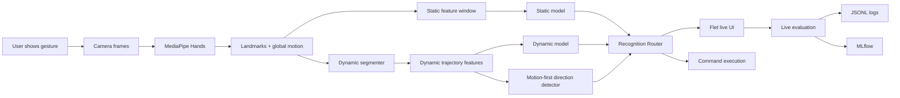
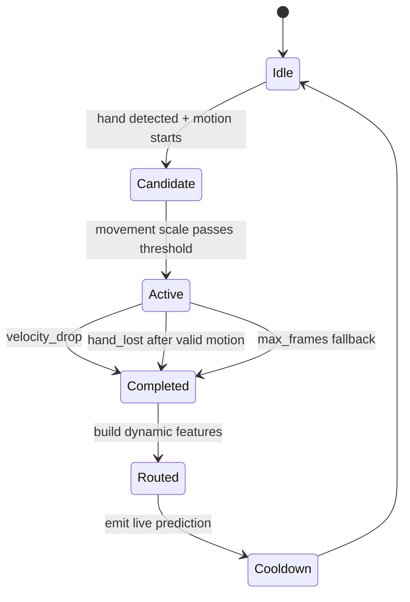
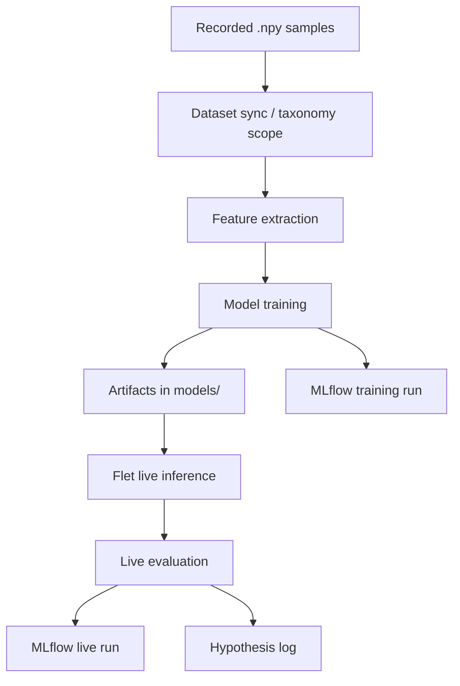

# GestureFlow ML System Design

Last updated: `2026-06-27`

Purpose: единый living-документ по ML-системе GestureFlow для JMLC. Здесь
фиксируется не только текущая архитектура, но и путь разработки: что уже
стабильно, что валидируется, что находится в работе и какие метрики доказывают
прогресс.

## 1. Status Board

| Area | Status | Evidence | Next check |
|---|---|---|---|
| Static gesture recognition | Stable | legacy/static pipeline works through Flet | refresh per-class live metrics |
| Dynamic gesture recording | Stable | developer UI records dynamic samples | keep protocol in `gesture_protocol.md` |
| Dynamic natural swipe segmentation | Validated | H-036/H-038, `velocity_drop` and `hand_lost` events | repeat near/mid/far validation |
| Auto routing static/dynamic | Validated | H-038: static hijack `0%` on 30 fresh dynamic attempts | add negative/no-gesture live run |
| `swipe_left` dynamic recognition | Stable | H-038: `10/10`, `100%` recall | keep as current baseline |
| `swipe_up/down` dynamic recognition | In Progress | H-038: `7/10`, wrong direction `30%` | analyze correct vs wrong trajectory features |
| Negative examples / rejection layer | Added | synthetic negative generation + ML fallback metadata | run live negative validation |
| MLflow experiment tracking | Stable | training and live runs in `GestureFlow` experiment | compare live runs after every test |
| HTML MLOps dashboard | Stable | `docs/mlops_dashboard/index.html` | regenerate before demo |
| AI/multi-agent layer | Planned | router/data/MLOps agent design exists conceptually | implement non-critical assistant workflows |

Status legend:

| Status | Meaning |
|---|---|
| Stable | Works, has tests or live evidence, can be shown in demo |
| Validated | Solved a specific hypothesis, needs periodic re-check |
| Added | Implemented, but not enough live evidence yet |
| In Progress | Main current improvement target |
| Planned | Designed, not production-critical yet |
| Blocked | Needs user data, environment access, or external decision |

## 2. Product Goal

GestureFlow is a personalized gesture-control system for desktop workflows. A
user records their own gestures with a webcam, trains recognition models, binds
recognized gestures to commands and then uses them in a live interface.

Contest framing:

- not a notebook-only classifier;
- a full ML Engineering system with data collection, preprocessing, model
  training, online inference, live evaluation, MLOps tracking and product UI;
- current ML focus: robust dynamic gesture recognition under small personal
  datasets.

## 3. End-to-End ML Flow

Core design choice: dynamic gestures are treated as temporal events, not as
static poses. A natural swipe should be recognized after movement ends by
`velocity_drop` or `hand_lost`, without requiring a final hold.

## 4. Data Sources

| Source | Path / system | What it contains | Status |
|---|---|---|---|
| Recorded samples | `data/gestures/<label>/sample_*.npy` | raw landmark sequences | Stable |
| Taxonomy | `configs/gesture_taxonomy.json` | static/dynamic/negative label scope | Stable |
| Static model artifacts | `models/knn.pkl`, `classes.json` | static/quasi-static recognizer | Stable |
| Dynamic model artifacts | `models/dynamic_knn.pkl`, `dynamic_classes.json` | dynamic recognizer | Stable |
| Negative synthetic samples | `docs/experiments/negative_sampling_manifest.json` | reproducible generated negative set | Added |
| Live eval logs | `~/.dplm/logs/live_evaluation.jsonl` | attempt-level real-camera results | Stable |
| Runtime logs | `~/.dplm/logs/runtime_performance.jsonl` | latency/FPS diagnostics | Stable |
| MLflow backend | `mlflow.db` | training/live experiment history | Stable |
| HTML dashboard | `docs/mlops_dashboard/` | local snapshot for demo | Stable |

## 5. Feature Design

### Static / Quasi-Static

Static gestures are represented by window-level pose statistics. The model
should be conservative: a static gesture is confirmed over multiple frames to
avoid accidental command execution.

Current properties:

- uses MediaPipe hand landmarks;
- confirms via dwell/anti-bounce logic;
- participates in auto routing only when dynamic route is not active.

### Dynamic

Dynamic gestures use trajectory-level features and a motion-first layer.

Key signals:

| Signal | Why it matters |
|---|---|
| `dynamic_axis` | separates horizontal vs vertical motion |
| `dynamic_direction` | maps movement to `left`, `up`, `down` |
| `dynamic_axis_ratio` | detects diagonal contamination |
| `dynamic_straightness` | penalizes curved/noisy motion |
| `dynamic_motion_scale` | normalizes movement magnitude |
| `dynamic_segment_frames` | captures gesture duration |
| `dynamic_end_reason` | shows whether natural swipe ended by movement or hand loss |

Latest evidence:

| Expected | Score | Static hijack | Wrong direction | Avg latency |
|---|---:|---:|---:|---:|
| `swipe_up` | `7/10` | `0%` | `30%` | `2.02s` |
| `swipe_down` | `7/10` | `0%` | `30%` | `2.60s` |
| `swipe_left` | `10/10` | `0%` | `0%` | `1.46s` |

Interpretation: routing is now good; vertical direction separation is the
current bottleneck.

## 6. Online Inference Design

Router policy:

| Case | Decision |
|---|---|
| dynamic segment completed and accepted | route=`dynamic` |
| dynamic and model/motion agree | decision=`motion_and_model_agree` |
| dynamic motion valid but model weak | motion-first fallback can still emit |
| no dynamic event and static label stable | route=`static` |
| negative/rejection condition | reject or mark as negative |

Important invariant: during a dynamic live test, static route is counted as
`wrong`, not ignored. This is how `live_static_hijack_rate` remains honest.

## 7. Training Pipeline

Training artifacts:

| Artifact | Purpose |
|---|---|
| `models/dynamic_knn.pkl` | current dynamic baseline |
| `models/dynamic_svm.pkl` | candidate comparison |
| `models/dynamic_extra_trees.pkl` | candidate comparison |
| `models/dynamic_feature_mode.txt` | feature contract |
| `models/dynamic_feature_dim.txt` | inference dimension contract |
| `models/dynamic_classes.json` | class order contract |

Current model choice:

- KNN remains the live baseline because it works best with small personalized
  samples and motion-first routing.
- SVM/ExtraTrees were kept as candidates, but live evidence was worse.
- Next model step should be data/feature improvement before adding LSTM or
  Transformers.

## 8. Evaluation Metrics

Offline metrics:

| Metric | Purpose |
|---|---|
| accuracy | broad sanity check |
| macro F1 | class-balanced quality |
| per-class recall | catches weak classes |
| confusion matrix | finds direction/class mixups |
| threshold report | confidence vs coverage |

Live metrics:

| Metric | Purpose |
|---|---|
| `live_accuracy` | correct / emitted attempts |
| `live_recall` | correct / target attempts |
| `live_static_hijack_rate` | dynamic classified as static |
| `live_wrong_dynamic_direction_rate` | swipe direction confusion |
| `live_negative_false_positive_rate` | false trigger on negative scenario |
| `live_latency_avg_s`, `p50`, `p95` | interaction delay |
| `live_end_reason_*` | natural swipe completion diagnostics |
| `live_decision_*` | router decision diagnostics |

Acceptance targets for contest demo:

| Target | Desired value |
|---|---:|
| static hijack on dynamic tests | `0%` |
| `swipe_left` recall | `>=90%` |
| `swipe_up/down` recall | `>=80%` |
| negative false positive rate | `<=10%` |
| p95 live latency | under interactive threshold, explain if higher |

## 9. MLOps Design

Two complementary observability layers are used:

| Layer | Role | Command |
|---|---|---|
| MLflow | experiment history for training and live tests | `PYTHON=.venv/bin/python make mlflow-ui` |
| HTML dashboard | static snapshot for demo and quick review | `make mlops-dashboard` |

MLflow run types:

| Run kind | Name pattern | Logged content |
|---|---|---|
| Training | `<model>-<feature_mode>` | params, model artifacts, sample count, train accuracy |
| Live evaluation | `live-<expected>-<mode>-<profile>` | live metrics, route counts, raw attempts artifact |

Every meaningful live test should be followed by:

1. Check MLflow run exists.
2. Compare `live_accuracy`, `live_static_hijack_rate`,
   `live_wrong_dynamic_direction_rate`.
3. Write conclusion to `docs/experiments/ml_pipeline_log.md`.
4. Update this file's Status Board if a component changed status.

## 10. AI / Multi-Agent Layer

The core recognizer is deterministic ML/CV, not LLM-driven. AI agents are useful
around the ML lifecycle, where they improve research velocity and traceability.

| Agent | Status | Responsibility |
|---|---|---|
| Router Agent | Planned | explain static/dynamic route decisions and reject unsafe output |
| Data Quality Agent | Planned | inspect new samples for scale, position, axis and speed drift |
| Experiment Agent | Planned | summarize MLflow runs and propose next hypothesis |
| Product Feedback Agent | Planned | turn user live-test notes into tracked issues |
| Documentation Agent | Added manually | keep `ml_pipeline_log.md` and this design doc current |

Rule: LLM/agent output must not directly execute OS commands. It can recommend,
summarize and annotate; execution stays behind deterministic policies.

## 11. Development Path

| Phase | Status | Result |
|---|---|---|
| Static baseline | Stable | simple gestures recognized from webcam |
| Dynamic recording | Stable | UI can record dynamic gesture samples |
| Model comparison | Validated | KNN/SVM/ExtraTrees separated; KNN kept for live |
| Live evaluation mode | Stable | real attempts counted as correct/wrong/missed |
| Natural swipe | Validated | no final pose required |
| Negative examples | Added | synthetic negatives generated automatically |
| MLflow integration | Stable | training and live runs tracked |
| Auto routing | Validated | fresh static hijack `0%` |
| Vertical direction quality | In Progress | `swipe_up/down` recall `70%` |
| User/market feedback | Planned | needed for product thinking criterion |

## 12. Current Risks

| Risk | Impact | Mitigation |
|---|---|---|
| Small personal dataset | model overfits recording conditions | augment position/scale/speed, collect controlled live tests |
| Vertical direction confusion | `swipe_up/down` unstable | analyze correct/wrong features, strengthen axis gate |
| No negative live validation yet | false triggers may be hidden | run 10-20 no-gesture/background attempts |
| Dirty local workspace | accidental commits/noisy demo | commit scoped files only, keep branch clean before submission |
| MLflow local-only | harder to review remotely | export screenshots/summary and keep `mlflow.db` ignored |

## 13. Next Engineering Steps

### Now

| Task | Status | Owner |
|---|---|---|
| Analyze `swipe_up/down` correct vs wrong trajectory features | In Progress | ML pipeline |
| Run negative live evaluation and log to MLflow | Next | user + ML pipeline |
| Regenerate HTML MLOps dashboard after fresh tests | Next | MLOps |

### Next

| Task | Status | Owner |
|---|---|---|
| Add direction-gate report for live attempts | Planned | ML pipeline |
| Add UI link/instruction for MLflow and dashboard | Planned | product/dev |
| Add model card for current dynamic KNN | Planned | ML pipeline |

### Later

| Task | Status | Owner |
|---|---|---|
| Try sequence model only after data quality stabilizes | Backlog | ML research |
| Add user study script and feedback table | Backlog | product |
| Package reproducible demo mode | Backlog | engineering |

## 14. How To Update This File

Use this doc as the high-level map and keep raw details in experiment files.

When something changes:

1. Update `Last updated`.
2. Update `Status Board`.
3. Add evidence from MLflow or tests.
4. If it is a hypothesis result, add full details to
   `docs/experiments/ml_pipeline_log.md`.
5. Keep statuses conservative: do not mark `Stable` without either tests or
   live evidence.

Change log:

| Date | Change | Evidence |
|---|---|---|
| `2026-06-27` | Created ML system design doc | H-038, MLflow live runs |
